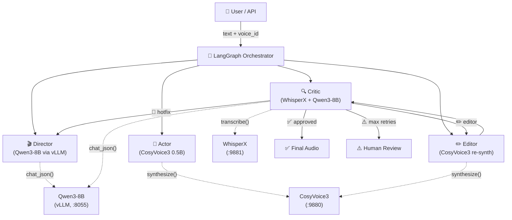
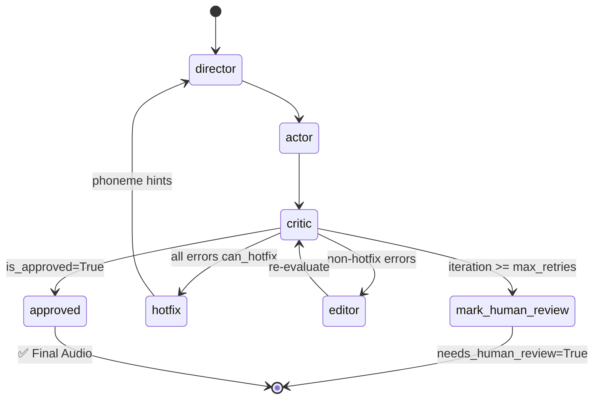

# ReflexTTS Agent System — Architecture & Dataflow

> A self-correcting Text-to-Speech pipeline built on 4 agents:
> **Director → Actor → Critic → Editor**, orchestrated via **LangGraph**.
>
> **Полная архитектура, ограничения и failure modes** →
> [docs/system-design.md](system-design.md)

---

## Table of Contents

1. [High-Level Architecture](#high-level-architecture)
2. [GraphState — Shared State](#graphstate--shared-state)
3. [Director Agent](#1-director-agent)
4. [Actor Agent](#2-actor-agent)
5. [Critic Agent](#3-critic-agent)
6. [Editor Agent](#4-editor-agent)
7. [LangGraph Orchestrator](#5-langgraph-orchestrator)
8. [Inference Clients](#6-inference-clients)
9. [Audio Utilities](#7-audio-utilities)
10. [End-to-End Example](#8-end-to-end-example)

> **Подробные спецификации модулей** → [docs/specs/](specs/)
> **C4 и workflow-диаграммы** → [docs/diagrams/](diagrams/)

---

## High-Level Architecture



> **C4 Context / Container / Component** → [docs/diagrams/](diagrams/)

---

## GraphState — Shared State

All agents communicate through a single `GraphState` structure (file `src/orchestrator/state.py`).

> **Полная спецификация state, memory policy, context budget** →
> [docs/specs/memory-context.md](specs/memory-context.md)

| Group | Field | Type | Written by | Read by |
|-------|-------|------|-----------|---------|
| **Input** | `text` | `str` | User | Director |
| | `voice_id` | `str` | User | Actor, Editor |
| | `trace_id` | `str` | API | All |
| **Director** | `ssml_markup` | `dict` | Director | Actor, Critic, Editor |
| | `tts_instruct` | `str` | Director | Actor |
| **Actor** | `audio_bytes` | `bytes` | Actor, Editor | Critic |
| | `segment_audio` | `list[bytes]` | Actor, Editor | Critic, Editor |
| | `segment_approved` | `list[bool]` | Critic | Actor, Editor |
| **Critic** | `errors` | `list[DetectedError]` | Critic (Judge) | Editor, Director, Graph |
| | `wer` | `float` | Critic | Graph routing |
| | `is_approved` | `bool` | Critic | Graph routing |
| **Control** | `iteration` | `int` | Graph | Graph routing |
| | `max_retries` | `int` | Config | Graph routing |

---

## 1. Director Agent

**File:** `src/agents/director.py` · **Model:** Qwen3-8B (via vLLM)

**Input:** `state.text` → **Output:** `state.ssml_markup` (segments + emotions), `state.tts_instruct`

Key mechanisms:
1. **Segmentation**: LLM splits text into phrases, assigns emotions
2. **Hotfix Injection** (`_apply_hotfix_hints()`): on retry, injects phoneme hints from Critic errors
3. **Emotion fallback**: unknown emotions → `"neutral"` via `Segment._fallback_unknown_emotion()`

```python
# Iteration 0: first call
state = await run_director(state, vllm_client)
# state.ssml_markup = {segments: [{text: "Hello!", emotion: "happy", ...}], ...}

# Iteration 1: retry with hotfix hint
# segment.text = "[ˈmɒskaʊ]Moscow is the capital of Russia."
```

---

## 2. Actor Agent

**File:** `src/agents/actor.py` · **Model:** CosyVoice3 0.5B

**Input:** `state.ssml_markup.segments[]` → **Output:** `state.audio_bytes`, `state.segment_audio[]`

Key mechanisms:
1. **Parallel synthesis** (M10): `asyncio.gather()` + `Semaphore(4)`
2. **Caching approved segments**: `segment_approved[i] == True` → reuse from cache
3. **WAV encoding**: 16-bit PCM, 24000 Hz, silence inserts between segments

---

## 3. Critic Agent

**File:** `src/agents/critic.py` · **Models:** WhisperX + Qwen3-8B Judge

**Input:** `state.segment_audio[]` → **Output:** `state.errors[]`, `state.wer`, `state.is_approved`, `state.segment_approved[]`

Two-phase per-segment evaluation:
1. **Phase 1 (ASR)**: `WhisperX.transcribe(segment_wav)` → transcript + word_timestamps
2. **Phase 2 (Judge)**: `Qwen3.chat_json({target, transcript})` → errors + WER + is_approved

Severity: `CRITICAL` (wrong word) · `WARNING` (mispronunciation) · `INFO` (minor)

---

## 4. Editor Agent

**File:** `src/agents/editor.py` · **Model:** CosyVoice3 0.5B

**Input:** `state.errors[]`, `state.segment_approved[]` → **Output:** repaired `state.audio_bytes`

Key mechanisms:
1. **Segment-level re-synth** (M11): full segment re-synthesis, not word-level splicing
2. **Skip logic**: no errors → skip; all can_hotfix → skip (Director handles)
3. **Rebuild**: `_rebuild_combined_audio()` reassembles from all `segment_audio[]`
4. **Convergence**: `0.5*(1-WER) + 0.3*SECS + 0.2*(PESQ/4.5)` ≥ 0.85

---

## 5. LangGraph Orchestrator

**Files:** `src/orchestrator/graph.py`, `src/orchestrator/state.py`

> **Полная спецификация шагов, переходов, stop conditions, retry** →
> [docs/specs/agent-orchestrator.md](specs/agent-orchestrator.md)
>
> **Workflow-диаграмма с ветками ошибок** →
> [docs/diagrams/workflow.md](diagrams/workflow.md)



---

## 6. Inference Clients

> **Полные контракты, errors, timeouts, side effects** →
> [docs/specs/tools-apis.md](specs/tools-apis.md)

| Client | Model | Protocol | Used by |
|--------|-------|----------|---------|
| `VLLMClient` | Qwen3-8B AWQ | OpenAI API (:8055) | Director, Critic |
| `TTSClient` | CosyVoice3 0.5B | HTTP REST (:9880) | Actor, Editor |
| `ASRClient` | WhisperX large-v3 | HTTP REST (:9881) | Critic |

---

## 7. Audio Utilities

**Directory:** `src/audio/`

| Module | Purpose |
|--------|---------|
| `alignment.py` | Map timestamps (ms) → mel-frame indices |
| `masking.py` | Binary mask + cosine taper for FM inpainting |
| `crossfade.py` | Equal-power cross-fade |
| `metrics.py` | Convergence score: `0.5(1-WER) + 0.3*SECS + 0.2*(PESQ/4.5)` |

---

## 8. End-to-End Example

### Scenario: 2 iterations (Editor re-synth)

```
├── Iteration 0:
│   ├── Director → 2 segments
│   ├── Actor → 2 WAVs (parallel, Semaphore=4)
│   ├── Critic:
│   │   seg[0] ✅ (WER=0.0)
│   │   seg[1] ❌ (WER=0.5, "million" → "billion", critical)
│   └── Route: "editor"
│
├── Iteration 1:
│   ├── Editor: re-synth seg[1], rebuild combined audio
│   ├── Critic:
│   │   seg[0]: skip (approved ✅)
│   │   seg[1]: WER=0.0 ✅
│   └── Route: "approved" → END ✅
│
└── Result: 2 iterations, WER=0.0, 2/2 approved
```

> **Полный sequence diagram** → [docs/diagrams/workflow.md](diagrams/workflow.md)
> **Data flow и lifecycle** → [docs/diagrams/data-flow.md](diagrams/data-flow.md)
