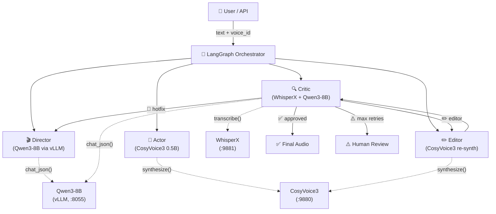
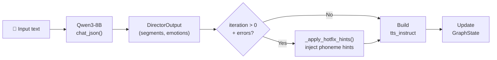
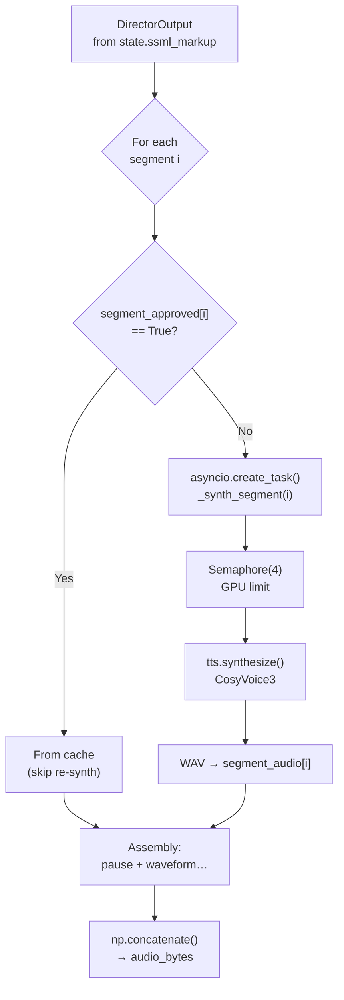
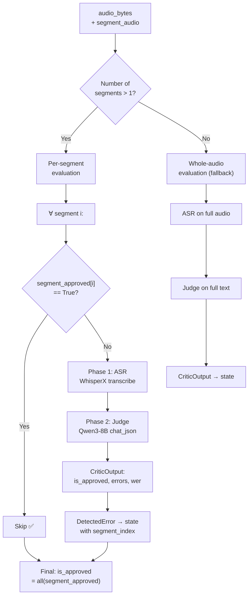
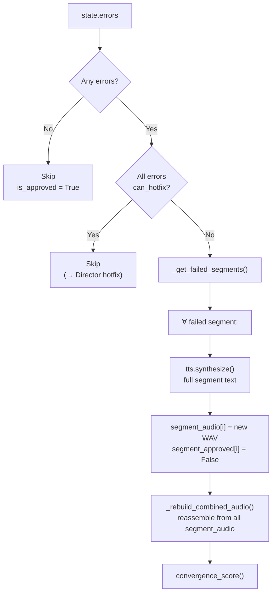
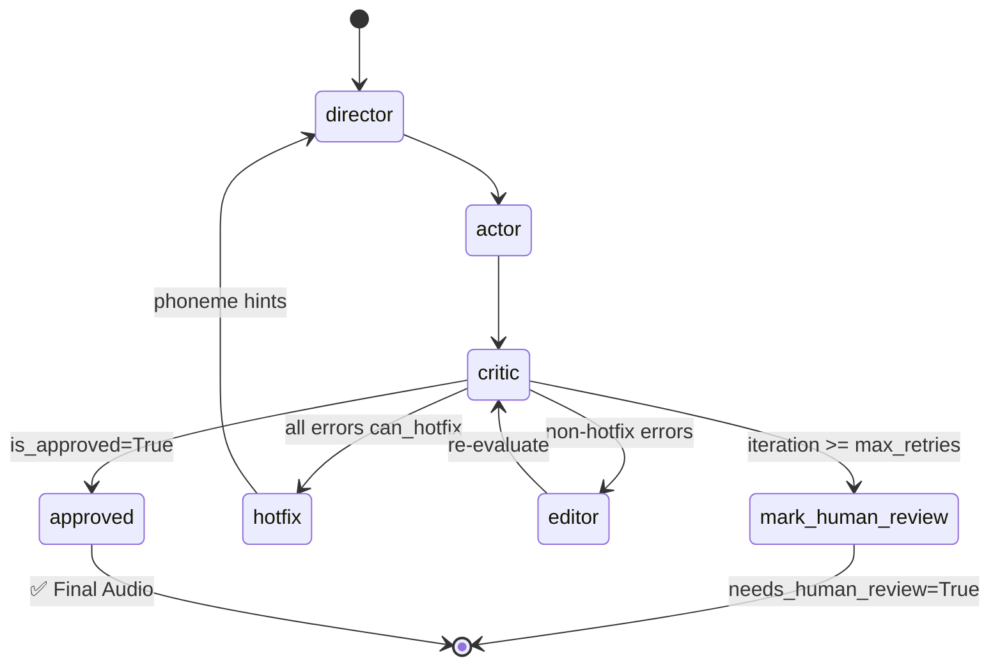
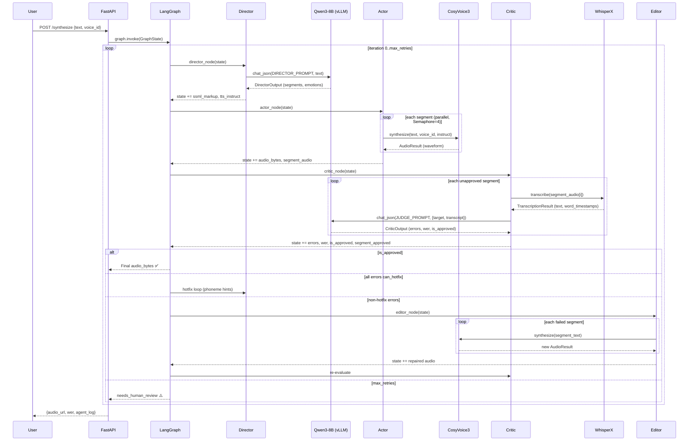

# ReflexTTS Agent System — Architecture & Dataflow

> A self-correcting Text-to-Speech pipeline built on 4 agents:
> **Director → Actor → Critic → Editor**, orchestrated via **LangGraph**.

---

## Table of Contents

1. [High-Level Architecture](#high-level-architecture)
2. [GraphState — Shared State](#graphstate--shared-state)
3. [Director Agent](#1-director-agent)
4. [Actor Agent](#2-actor-agent)
5. [Critic Agent](#3-critic-agent)
6. [Editor Agent](#4-editor-agent)
7. [LangGraph Orchestrator](#5-langgraph-orchestrator)
8. [Inference Clients](#6-inference-clients)
9. [Audio Utilities](#7-audio-utilities)
10. [End-to-End Example](#8-end-to-end-example)
11. [Full Dataflow Diagram](#9-full-dataflow-diagram)

---

## High-Level Architecture



**How it works**: user text passes sequentially through Director → Actor → Critic. If the Critic finds errors, the loop repeats via Director (hotfix) or Editor (re-synth) until the audio is approved or the retry limit is exhausted.

---

## GraphState — Shared State

All agents communicate through a single `GraphState` structure (file `src/orchestrator/state.py`), passed as shared state in LangGraph.

| Group | Field | Type | Written by | Read by | Description |
|-------|-------|------|-----------|---------|-------------|
| **Input** | `text` | `str` | User | Director | Raw input text to synthesize |
| | `voice_id` | `str` | User | Actor, Editor | Voice identifier (`speaker_1`, `speaker_2`, …) |
| | `trace_id` | `str` | API | All | Trace ID for logging |
| **Director** | `ssml_markup` | `dict` | Director | Actor, Critic, Editor | Serialized `DirectorOutput` (segments, emotions, pauses) |
| | `tts_instruct` | `str` | Director | Actor | Style instruction string (`"Speak with happy tone"`) |
| **Actor** | `audio_bytes` | `bytes` | Actor, Editor | Critic | Final WAV (16-bit PCM, all segments concatenated) |
| | `sample_rate` | `int` | Actor | Critic, Editor | Sample rate (24000 Hz) |
| | `segment_audio` | `list[bytes]` | Actor, Editor | Critic, Editor | Per-segment WAV audio bytes |
| | `segment_approved` | `list[bool]` | Critic | Actor, Editor | Per-segment approval status |
| **Critic** | `transcript` | `str` | Critic (ASR) | Critic (Judge) | Recognized text |
| | `word_timestamps` | `list[dict]` | Critic (ASR) | Critic (Judge) | Per-word time boundaries |
| | `errors` | `list[DetectedError]` | Critic (Judge) | Editor, Director, Graph | Detected errors with severity and segment_index |
| | `wer` | `float` | Critic | Graph routing | Word Error Rate (0.0–1.0) |
| | `is_approved` | `bool` | Critic | Graph routing | Whether the audio result is accepted |
| **Control** | `iteration` | `int` | Graph | Graph routing | Current iteration number (0-based) |
| | `max_retries` | `int` | Config | Graph routing | Max iteration count (default: 3) |
| | `needs_human_review` | `bool` | Graph | API | Escalation flag |
| | `convergence_score` | `float` | Editor | Observability | Convergence metric |
| **Log** | `agent_log` | `list[AgentLogEntry]` | All | API, UI | Action log from each agent |

### Supporting Types

#### `DetectedError`
```python
class DetectedError(BaseModel):
    word_expected: str       # Expected word
    word_actual: str         # What was actually spoken
    start_ms: float          # Error start time (ms)
    end_ms: float            # Error end time (ms)
    severity: ErrorSeverity  # critical / warning / info
    can_hotfix: bool         # Whether fixable via phoneme hint
    hotfix_hint: str         # e.g. "[sh][ip]"
    segment_index: int       # Segment index (-1 = unknown)
```

#### `AgentLogEntry`
```python
class AgentLogEntry(BaseModel):
    agent: str      # "director" | "actor" | "critic" | "editor" | "orchestrator"
    action: str     # "analyzed" | "synthesized" | "evaluated" | "segment_regen" ...
    detail: str     # Action details
```

---

## 1. Director Agent

**File:** `src/agents/director.py`  
**Model:** Qwen3-8B (via vLLM)  
**Role:** Analyzes input text and produces structured synthesis instructions.

### Workflow



### Dataflow

```
Input:  state.text = "Hello! How are you? Glad to see you."
        state.voice_id = "speaker_1"
        state.iteration = 0

  │  Builds prompt: DIRECTOR_SYSTEM_PROMPT + user_message
  │  Sends to vLLM via chat_json()
  ▼

Output: state.ssml_markup = {
          "segments": [
            {"text": "Hello!", "emotion": "happy", "pause_before_ms": 0, "phoneme_hints": []},
            {"text": "How are you?", "emotion": "neutral", "pause_before_ms": 300, "phoneme_hints": []},
            {"text": "Glad to see you.", "emotion": "happy", "pause_before_ms": 200, "phoneme_hints": []}
          ],
          "voice_id": "speaker_1",
          "language": "Auto",
          "notes": "Short greeting with mixed emotions"
        }
        state.tts_instruct = "Speak with happy tone."
```

### Key Mechanisms

1. **Segmentation**: The LLM splits text into phrases/sentences, assigning an emotion to each.
2. **Hotfix Injection** (`_apply_hotfix_hints()`): on retry iterations (when Critic found pronunciation errors), Director injects phoneme hints directly into the segment text:
   ```
   Before: "The yield values are rising."
   After:  "[j][iː][l][d]yield values are rising."    ← HOTFIX_HINT from CriticError
   ```
3. **Emotion fallback**: unknown emotions (if the LLM outputs `"gentle"`) are automatically mapped to `"neutral"` via `Segment._fallback_unknown_emotion()`.

### Example

```python
# Iteration 0: first call
state = GraphState(text="Moscow is the capital of Russia.", voice_id="speaker_1")
state = await run_director(state, vllm_client)

# Result:
# state.ssml_markup = {
#   "segments": [{"text": "Moscow is the capital of Russia.", "emotion": "neutral", ...}],
#   "voice_id": "speaker_1", "language": "en"
# }
# state.tts_instruct = ""  (no special instructions for neutral)

# Iteration 1: retry after Critic error
state.errors = [DetectedError(word_expected="Moscow", word_actual="Mascow",
                              can_hotfix=True, hotfix_hint="[ˈmɒskaʊ]")]
state.iteration = 1
state = await run_director(state, vllm_client)
# Director LLM re-segments the text, then _apply_hotfix_hints() injects the hint:
# segment.text = "[ˈmɒskaʊ]Moscow is the capital of Russia."
```

---

## 2. Actor Agent

**File:** `src/agents/actor.py`  
**Model:** CosyVoice3 0.5B (via HTTP microservice)  
**Role:** Synthesizes speech from Director-prepared segments.

### Workflow



### Dataflow

```
Input:  state.ssml_markup = { "segments": [...3 segments...] }
        state.segment_approved = [False, False, False]

  │  Parallel synthesis (asyncio.gather + Semaphore(4)):
  │    seg[0]: "Hello!"          → CosyVoice3 → WAV (0.8s)
  │    seg[1]: "How are you?"    → CosyVoice3 → WAV (1.2s)
  │    seg[2]: "Glad to see you."→ CosyVoice3 → WAV (1.5s)
  │
  │  Assembly: pause(0ms) + wav[0] + pause(300ms) + wav[1] + pause(200ms) + wav[2]
  ▼

Output: state.audio_bytes = <WAV bytes, ~3.5s, 16-bit PCM>
        state.segment_audio = [<wav_seg_0>, <wav_seg_1>, <wav_seg_2>]
        state.sample_rate = 24000
```

### Key Mechanisms

1. **Parallel synthesis** (M10): `asyncio.gather()` + `Semaphore(max_concurrency=4)` — up to 4 segments synthesized concurrently on GPU.
2. **Caching approved segments**: on retry iterations, segments with `segment_approved[i] == True` are reused from `segment_audio[i]` without calling CosyVoice3.
3. **WAV encoding/decoding**: `_encode_wav()` and `_decode_wav_to_array()` — low-level WAV handling without external libraries.
4. **Pauses**: silence (`np.zeros`) is inserted between segments per `segment.pause_before_ms`.

### Example

```python
state = GraphState(
    ssml_markup={
        "segments": [
            {"text": "Hello!", "emotion": "happy", "pause_before_ms": 0, "phoneme_hints": []},
            {"text": "How are you?", "emotion": "neutral", "pause_before_ms": 300, "phoneme_hints": []},
        ],
        "voice_id": "speaker_1"
    },
    voice_id="speaker_1"
)

state = await run_actor(state, tts_client, max_concurrency=4)

# Result:
# state.audio_bytes = b'RIFF...'  (WAV, ~2 seconds)
# state.segment_audio = [b'RIFF...', b'RIFF...']  (each segment separately)
# state.sample_rate = 24000
# agent_log: {"agent": "actor", "action": "synthesized",
#             "detail": "2.03s audio (2 new, 0 cached, parallel=4)"}
```

---

## 3. Critic Agent

**File:** `src/agents/critic.py`  
**Models:** WhisperX (ASR, large-v3) + Qwen3-8B (Judge)  
**Role:** Two-phase quality assessment of synthesized speech.

### Workflow



### Dataflow — Per-segment mode (primary)

```
Input:  state.audio_bytes = <WAV, 3 segments>
        state.segment_audio = [seg_0_wav, seg_1_wav, seg_2_wav]
        state.ssml_markup.segments = [
          {"text": "Hello!"},
          {"text": "How are you?"},
          {"text": "Glad to see you."}
        ]

  │  For each unapproved segment:
  │
  │  Segment 0: "Hello!"
  │    Phase 1 (ASR):   WhisperX(seg_0_wav) → "Hello!"
  │    Phase 2 (Judge): Qwen3 compares "Hello!" vs "Hello!" → WER=0, approved ✅
  │
  │  Segment 1: "How are you?"
  │    Phase 1 (ASR):   WhisperX(seg_1_wav) → "How are your?"
  │    Phase 2 (Judge): "How are you?" vs "How are your?" → ERROR: expected="you", actual="your"
  │                     severity=critical, can_hotfix=False, WER=0.33 ❌
  │
  │  Segment 2: "Glad to see you."
  │    Phase 1 (ASR):   WhisperX(seg_2_wav) → "Glad to see you."
  │    Phase 2 (Judge): Full match → WER=0, approved ✅
  ▼

Output: state.errors = [DetectedError(word_expected="you", word_actual="your",
                                       severity="critical", segment_index=1)]
        state.wer = 0.11  (average across segments)
        state.is_approved = False
        state.segment_approved = [True, False, True]
        state.iteration += 1  (incremented in graph.py after critic_node)
```

### Key Mechanisms

1. **Per-segment evaluation** (M9): each segment is evaluated individually → precise identification of problem areas, saving on re-synthesis.
2. **Two-phase assessment**:
   - **Phase 1 (ASR)**: WhisperX transcribes the audio, providing `word_timestamps` with confidence scores.
   - **Phase 2 (Judge)**: LLM compares target text and transcript, classifying errors by severity.
3. **Severity classification**:
   - `CRITICAL`: missing/extra word, hallucination
   - `WARNING`: mispronunciation (visible in transcript)
   - `INFO`: minor difference (article, accent)
4. **Hotfix detection**: the Judge determines if an error can be fixed via phoneme hint (`can_hotfix=True`).

### Example

```python
# Critic receives audio from Actor and checks quality:
state = await run_critic(state, asr_client, vllm_client)

# For each segment:
#   [segment 0] ASR: "Hello!" → Judge: approved ✅ (WER=0.0)
#   [segment 1] ASR: "How are your?" → Judge: ERROR ❌ (WER=0.33)
#     → DetectedError(word_expected="you", word_actual="your",
#                      severity="critical", can_hotfix=False, segment_index=1)
#   [segment 2] ASR: "Glad to see you." → Judge: approved ✅ (WER=0.0)

# Result: state.is_approved = False (segment 1 failed)
#          state.segment_approved = [True, False, True]
```

---

## 4. Editor Agent

**File:** `src/agents/editor.py`  
**Model:** CosyVoice3 0.5B (via HTTP microservice)  
**Role:** Re-synthesizes only failed segments and rebuilds final audio.

### Workflow



### Dataflow

```
Input:  state.errors = [DetectedError(segment_index=1, can_hotfix=False, ...)]
        state.segment_approved = [True, False, True]
        state.segment_audio = [seg0_wav, seg1_wav, seg2_wav]
        state.ssml_markup.segments = [{text: "Hello!", ...}, {text: "How are you?", ...}, ...]

  │  1. _get_failed_segments():
  │     → from segment_approved: index 1 (not approved)
  │     → from errors: index 1 (non-hotfix error)
  │     → failed = [1]
  │
  │  2. _regen_segments(): for each failed segment:
  │     seg[1]: tts.synthesize("How are you?", voice="speaker_1") → new WAV
  │     segment_audio[1] = new_wav
  │     segment_approved[1] = False  (will be re-evaluated by Critic)
  │
  │  3. _rebuild_combined_audio():
  │     audio_bytes = concat(seg0_wav + pause + NEW_seg1_wav + pause + seg2_wav)
  │
  │  4. convergence_score(wer=0.11) → score = 0.945
  ▼

Output: state.audio_bytes = <updated WAV>
        state.segment_audio[1] = <new WAV for segment 1>
        state.convergence_score = 0.945
```

### Key Mechanisms

1. **Segment-level re-synthesis** (M11): Editor re-synthesizes **entire segments** (`tts.synthesize(full_text)`), not individual words — producing clean audio without splicing artifacts.
2. **Incremental improvement**: with each iteration, more segments pass the Critic → fewer segments need re-synthesis:
   ```
   Iter 1: 1/6 approved  → Editor regen [0,1,2,3,5]
   Iter 2: 2/6 approved  → Editor regen [0,1,2,5]
   Iter 3: 3/6 approved  → escalated
   ```
3. **Convergence score**: `0.5*(1-WER) + 0.3*SECS + 0.2*(PESQ/4.5)`. Value ≥ 0.85 means converged.
4. **Rebuild**: `_rebuild_combined_audio()` reassembles the final WAV from all `segment_audio[]` with pauses.

### Example

```python
# After Critic found an error in segment 1:
state = await run_editor(state, tts_client)

# Editor determines: failed_segments = [1]
# Re-synth: "How are you?" → CosyVoice3 → new WAV
# Rebuild: all 3 segments are concatenated again
# agent_log: {"agent": "editor", "action": "segment_regen",
#             "detail": "re-synthesized segments [1]"}
```

---

## 5. LangGraph Orchestrator

**Files:** `src/orchestrator/graph.py`, `src/orchestrator/state.py`  
**Role:** Controls agent execution order and routes based on Critic results.

### Workflow



### Routing Logic (`route_after_critic`)

The `route_after_critic()` function takes the state after Critic and returns one of 4 decisions:

| Route | Condition | Action |
|-------|-----------|--------|
| `approved` | `is_approved == True` | → END (audio accepted) |
| `needs_human_review` | `iteration >= max_retries` | → Escalate to human |
| `hotfix` | All errors from unapproved segments have `can_hotfix=True` | → Director (with phoneme hints) |
| `editor` | Non-hotfix errors exist | → Editor (segment re-synth) |

### Example

```
Iteration 0:
  director → splits text into 3 segments
  actor    → synthesizes 3 WAVs (parallel, Semaphore=4)
  critic   → seg[0] ✅, seg[1] ❌ (critical, can_hotfix=False), seg[2] ✅
  route    → "editor" (non-hotfix error exists)

Iteration 1:
  editor   → re-synth segment 1
  critic   → seg[1] ✅ (new WAV passed check)
  route    → "approved" (all segments approved)

→ END: final audio from 3 segments, WER=0.0
```

### Graph Construction (code)

```python
graph = StateGraph(dict)

graph.add_node("director", director_node)
graph.add_node("actor", actor_node)
graph.add_node("critic", critic_node)
graph.add_node("editor", editor_node)
graph.add_node("mark_human_review", mark_human_review)

graph.set_entry_point("director")
graph.add_edge("director", "actor")
graph.add_edge("actor", "critic")

graph.add_conditional_edges(
    "critic",
    route_after_critic,
    {
        "approved": END,
        "hotfix": "director",
        "editor": "editor",
        "needs_human_review": "mark_human_review",
    },
)

graph.add_edge("editor", "critic")
graph.add_edge("mark_human_review", END)
```

---

## 6. Inference Clients

### 6.1 VLLMClient (`src/inference/vllm_client.py`)

**Model:** Qwen3-8B-Instruct AWQ 4-bit  
**Protocol:** OpenAI-compatible API (AsyncOpenAI)  
**Used by:** Director + Critic Judge

| Method | Description | Used by |
|--------|-------------|---------|
| `chat(system_prompt, user_message)` | Raw text response | — |
| `chat_json(system_prompt, user_message, response_model)` | Structured JSON → Pydantic model | Director, Critic |
| `health_check()` | Check vLLM availability | Model Registry |

**Key features:**
- **`<think>` stripping**: Qwen3 generates `<think>...</think>` reasoning blocks — regex `_THINK_RE` removes them before JSON parsing.
- **Brace extraction fallback**: if JSON is invalid after stripping, `_extract_json_object()` extracts the first `{…}` object via brace counting.
- **Retry with backoff**: exponential backoff (`2^attempt` seconds) on `APIConnectionError` / `APITimeoutError`.
- **JSON mode**: `response_format: {"type": "json_object"}` in extra_body.

### 6.2 TTSClient (`src/inference/tts_client.py`)

**Model:** CosyVoice3 0.5B (Fun-CosyVoice3-0.5B)  
**Protocol:** HTTP (httpx)  
**Used by:** Actor + Editor

| Method | Description |
|--------|-------------|
| `synthesize(text, voice_id, instruct)` | Synthesize speech → `AudioResult(waveform, sample_rate)` |
| `clone_voice(text, ref_audio, ref_text)` | Voice cloning (cross-lingual) |
| `load_model()` | Check CosyVoice service availability |
| `health_check()` | Health probe |

**Voice map:**
| voice_id | CosyVoice speaker | Language |
|----------|-------------------|----------|
| `speaker_1` | 中文女 | Chinese |
| `speaker_2` | 中文男 | Chinese |
| `speaker_3` | 英文女 | English |

### 6.3 ASRClient (`src/inference/asr_client.py`)

**Model:** WhisperX (large-v3 + Wav2Vec2)  
**Protocol:** HTTP (httpx)  
**Used by:** Critic

| Method | Description |
|--------|-------------|
| `transcribe(audio, sample_rate)` | ASR → `TranscriptionResult(text, word_timestamps)` |
| `load_model()` | Check WhisperX service availability |
| `health_check()` | Health probe |

**Result example:**
```python
TranscriptionResult(
    text="Hello, how are you?",
    word_timestamps=[
        WordTimestamp(word="Hello,",  start_ms=240,  end_ms=680,  score=0.95),
        WordTimestamp(word="how",     start_ms=710,  end_ms=890,  score=0.98),
        WordTimestamp(word="are",     start_ms=920,  end_ms=1050, score=0.97),
        WordTimestamp(word="you?",    start_ms=1080, end_ms=1350, score=0.91),
    ],
    language="en"
)
```

---

## 7. Audio Utilities

**Directory:** `src/audio/`

| Module | Purpose | Key Functions |
|--------|---------|---------------|
| `alignment.py` | Map timestamps (ms) to mel-frame indices | `ms_to_mel_frame()`, `MelRegion`, `merge_regions()` |
| `masking.py` | Binary mask + cosine taper for FM inpainting | `apply_mask_to_mel()`, `create_inpainting_mask()` |
| `crossfade.py` | Equal-power cross-fade for audio blending | `crossfade_chunks()` |
| `metrics.py` | Convergence score for Editor | `convergence_score(wer, secs, pesq)`, `compute_secs()` |

### Convergence Score Formula

```
score = 0.5 * (1 - WER) + 0.3 * SECS + 0.2 * (PESQ / 4.5)
converged = score >= 0.85
```

| Weight | Metric | Description |
|--------|--------|-------------|
| 50% | WER | Word Error Rate (0 = perfect) |
| 30% | SECS | Speaker Embedding Cosine Similarity |
| 20% | PESQ | Perceptual Evaluation of Speech Quality (0–4.5) |

---

## 8. End-to-End Example

### Input

```json
{
  "text": "Moscow is the capital of Russia. The population is over 12 million people.",
  "voice_id": "speaker_1"
}
```

### Scenario A: Approved in 1 iteration

```
├── Director (Qwen3-8B):
│   └── Analyzes text, creates 2 segments:
│       seg[0]: "Moscow is the capital of Russia."  emotion=neutral  pause=0ms
│       seg[1]: "The population is over 12 million people."  emotion=serious  pause=400ms
│       tts_instruct = "Speak with serious tone."
│
├── Actor (CosyVoice3):
│   └── Parallel synthesis (Semaphore=4):
│       seg[0] → WAV (1.8s, 43200 samples)
│       seg[1] → WAV (2.5s, 60000 samples)
│       Combined: pause(0ms) + seg[0] + pause(400ms) + seg[1] = 4.7s WAV
│
├── Critic — Per-segment evaluation:
│   ├── seg[0]: ASR="Moscow is the capital of Russia." → Judge: WER=0.0 ✅
│   └── seg[1]: ASR="The population is over 12 million people." → Judge: WER=0.0 ✅
│
└── Route: "approved" → END ✅

Result: audio_bytes = <4.7s WAV>, WER=0.0, 2/2 segments approved
```

### Scenario B: 2 iterations (Editor re-synth)

```
├── Iteration 0:
│   ├── Director → 2 segments
│   ├── Actor → 2 WAVs
│   ├── Critic:
│   │   seg[0] ✅ (WER=0.0)
│   │   seg[1] ❌ (WER=0.5, "million" → "billion", critical, can_hotfix=False)
│   └── Route: "editor"
│
├── Iteration 1:
│   ├── Editor:
│   │   failed_segments = [1]
│   │   re-synth seg[1]: "The population is over 12 million people." → new WAV
│   │   _rebuild_combined_audio(): seg[0] (cached) + new seg[1]
│   ├── Critic:
│   │   seg[0]: skip (already approved ✅)
│   │   seg[1]: ASR="The population is over 12 million people." → WER=0.0 ✅
│   └── Route: "approved" → END ✅
│
└── Result: 2 iterations, WER=0.0, 2/2 approved
```

---

## 9. Full Dataflow Diagram



---

## Module Summary

| Module | Files | Role | Dependencies |
|--------|-------|------|-------------|
| **Director** | `agents/director.py`, `agents/prompts.py` | text → segments + emotions | VLLMClient |
| **Actor** | `agents/actor.py` | segments → WAV audio | TTSClient |
| **Critic** | `agents/critic.py`, `agents/prompts.py` | audio → transcript → errors | ASRClient, VLLMClient |
| **Editor** | `agents/editor.py` | failed segments → repaired audio | TTSClient |
| **Orchestrator** | `orchestrator/graph.py`, `orchestrator/state.py` | State machine, routing | LangGraph, all agents |
| **Schemas** | `agents/schemas.py` | Data contracts | Pydantic |
| **VLLMClient** | `inference/vllm_client.py` | LLM inference (Qwen3-8B) | AsyncOpenAI |
| **TTSClient** | `inference/tts_client.py` | TTS inference (CosyVoice3) | httpx |
| **ASRClient** | `inference/asr_client.py` | ASR inference (WhisperX) | httpx |
| **Audio Utils** | `audio/alignment.py`, `masking.py`, `crossfade.py`, `metrics.py` | Audio processing | numpy |
| **Security** | `security/input_sanitizer.py`, `pii_masker.py`, `voice_whitelist.py` | Input security | regex |
| **Monitoring** | `monitoring/__init__.py` | Prometheus metrics | — |
| **API** | `api/app.py`, `api/schemas.py`, `api/sessions.py` | FastAPI endpoints + Web UI | FastAPI, WebSocket |
