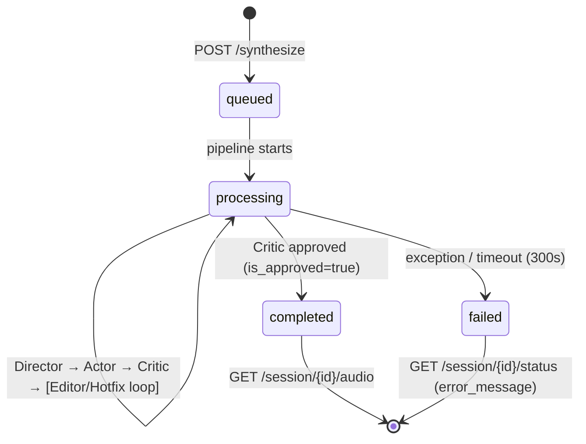

# ReflexTTS — API Contracts (Python)

> Complete reference for interacting with the ReflexTTS API from Python.
> Base URL: `http://localhost:8080` (default).
>
> **Internal client contracts (VLLMClient, TTSClient, ASRClient)** → [docs/specs/tools-apis.md](specs/tools-apis.md)
> **System architecture & failure modes** → [docs/system-design.md](system-design.md)

---

## Table of Contents

1. [Quick Start](#quick-start)
2. [REST API](#rest-api)
   - [GET /health](#get-health)
   - [GET /voices](#get-voices)
   - [POST /synthesize](#post-synthesize)
   - [GET /session/{id}/status](#get-sessionidstatus)
   - [GET /session/{id}/audio](#get-sessionidaudio)
   - [GET /metrics](#get-metrics)
3. [WebSocket API](#websocket-api)
   - [WS /ws/{session_id}](#ws-wssession_id)
4. [Full Example: Synthesize + Wait + Save](#full-example-synthesize--wait--save)
5. [Schemas (Data Contracts)](#schemas-data-contracts)
6. [Error Codes](#error-codes)
7. [Configuration (env)](#configuration-env)

---

## Quick Start

```python
import httpx

BASE = "http://localhost:8080"

# 1. Start synthesis
resp = httpx.post(f"{BASE}/synthesize", json={
    "text": "Hello! My name is Alex.",
    "voice_id": "speaker_1",
    "language": "auto",
})
session_id = resp.json()["session_id"]

# 2. Wait for completion
import time
while True:
    status = httpx.get(f"{BASE}/session/{session_id}/status").json()
    if status["status"] in ("completed", "failed"):
        break
    time.sleep(1)

# 3. Download audio
if status["status"] == "completed":
    audio = httpx.get(f"{BASE}/session/{session_id}/audio")
    with open("output.wav", "wb") as f:
        f.write(audio.content)
    print(f"Saved output.wav ({len(audio.content)} bytes)")
```

---

## REST API

### GET /health

Service health check.

```python
import httpx

resp = httpx.get("http://localhost:8080/health")
print(resp.json())
```

**Response** `200 OK`:

```json
{
  "status": "ok",
  "service": "reflex-tts"
}
```

---

### GET /voices

List available voices.

```python
resp = httpx.get("http://localhost:8080/voices")
voices = resp.json()["voices"]
print(voices)  # ["speaker_1", "speaker_2", "speaker_3"]
```

**Response** `200 OK`:

```json
{
  "voices": ["speaker_1", "speaker_2", "speaker_3"]
}
```

> [!NOTE]
> The voice whitelist is configured via the `SECURITY_WHITELISTED_VOICES` env variable.

---

### POST /synthesize

Start the synthesis pipeline. Returns **`202 Accepted`** immediately — processing runs in the background.

#### Request

```python
import httpx

resp = httpx.post("http://localhost:8080/synthesize", json={
    "text": "The quick brown fox jumps over the lazy dog.",
    "voice_id": "speaker_1",
    "language": "auto",
})
assert resp.status_code == 202
data = resp.json()
print(data)
```

**Request Body** (`SynthesizeRequest`):

| Field | Type | Required | Default | Description |
|-------|------|:--------:|:-------:|-------------|
| `text` | `str` | ✅ | — | Text to synthesize (1–5000 chars) |
| `voice_id` | `str` | ❌ | `"speaker_1"` | Voice from `/voices` |
| `language` | `str` | ❌ | `"auto"` | Language code or `"auto"` |

**Response** `202 Accepted` (`SynthesizeResponse`):

```json
{
  "session_id": "a3f1b2c4-5678-9abc-def0-1234567890ab",
  "status": "processing",
  "message": "Synthesis pipeline started"
}
```

> [!NOTE]
> When the pipeline is busy, requests are **queued** (not rejected). The `status` field will be `"queued"` with a `message` like `"Position 2 in queue"`.

#### Internal Pipeline

```
POST /synthesize
  ↓
1. Input sanitization    → reject prompt injection
2. PII masking           → [EMAIL_1], [PHONE_1]
3. Voice validation      → whitelist check
4. Rate limiting          → 429 if exceeded (10 req/min per IP)
5. Session create        → UUID
6. Enqueue pipeline      → queue.Queue + background worker
7. Response 202          → { session_id }
```

---

### GET /session/{id}/status

Get the current session status and agent log.

```python
import httpx

session_id = "a3f1b2c4-5678-9abc-def0-1234567890ab"
resp = httpx.get(f"http://localhost:8080/session/{session_id}/status")
status = resp.json()
print(status)
```

**Response** `200 OK` (`SessionStatus`):

```json
{
  "session_id": "a3f1b2c4-5678-9abc-def0-1234567890ab",
  "status": "completed",
  "iteration": 1,
  "max_iterations": 3,
  "wer": 0.0,
  "is_approved": true,
  "needs_human_review": false,
  "agent_log": [
    {"agent": "director", "action": "segments_created", "detail": "2 segments"},
    {"agent": "actor",    "action": "audio_synthesized", "detail": "3.2s, 24000 Hz"},
    {"agent": "critic",   "action": "approved",          "detail": "WER=0.000"}
  ],
  "error_message": null
}
```

| Field | Type | Description |
|-------|------|-------------|
| `session_id` | `str` | Session UUID |
| `status` | `str` | `"queued"` / `"processing"` / `"completed"` / `"failed"` |
| `iteration` | `int` | Current correction iteration (0-based) |
| `max_iterations` | `int` | Maximum iterations (default 3) |
| `wer` | `float \| null` | Word Error Rate (0.0 = perfect) |
| `is_approved` | `bool` | Whether the Critic approved the audio |
| `needs_human_review` | `bool` | Whether manual review is required |
| `agent_log` | `list[dict]` | Agent action log |
| `error_message` | `str \| null` | Error description (if `status=failed`) |
| `queue_position` | `int \| null` | Position in pipeline queue (null if not queued) |

---

### GET /session/{id}/audio

Download the final audio (WAV 16-bit PCM).

```python
import httpx

session_id = "a3f1b2c4-5678-9abc-def0-1234567890ab"
resp = httpx.get(f"http://localhost:8080/session/{session_id}/audio")

if resp.status_code == 200:
    with open("speech.wav", "wb") as f:
        f.write(resp.content)
    print(f"Saved: {len(resp.content)} bytes")
```

**Response** `200 OK`:
- `Content-Type: audio/wav`
- `Content-Disposition: attachment; filename={session_id}.wav`
- Body: raw WAV bytes

> [!IMPORTANT]
> Audio is available **only** when `status=completed`. If `status != completed`, a `409 Conflict` is returned.

---

### GET /metrics

Prometheus metrics (for monitoring).

```python
import httpx

resp = httpx.get("http://localhost:8080/metrics")
print(resp.text)  # Prometheus text format
```

**Response** `200 OK` — `text/plain` in Prometheus exposition format.

---

## WebSocket API

### WS /ws/{session_id}

Real-time streaming of agent logs and status updates via WebSocket.

```python
import asyncio
import json
import websockets

async def stream_agent_log(session_id: str) -> None:
    uri = f"ws://localhost:8080/ws/{session_id}"
    async with websockets.connect(uri) as ws:
        async for raw in ws:
            msg = json.loads(raw)

            if msg.get("type") == "status":
                print(f"[STATUS] {msg['status']} | iter={msg['iteration']} | WER={msg['wer']}")

            elif msg.get("type") == "done":
                print(f"[DONE] approved={msg['is_approved']}, final={msg['final_status']}")
                break

            elif "agent" in msg:
                print(f"[{msg['agent']}] {msg['action']}: {msg.get('detail', '')}")

asyncio.run(stream_agent_log("a3f1b2c4-5678-9abc-def0-1234567890ab"))
```

#### Message Types

**Agent Log Entry** (agent action):

```json
{"agent": "director", "action": "segments_created", "detail": "2 segments"}
```

**Status Update** (sent every ~0.5s):

```json
{
  "type": "status",
  "status": "processing",
  "iteration": 1,
  "wer": 0.05
}
```

**Done** (pipeline completion):

```json
{
  "type": "done",
  "is_approved": true,
  "final_status": "completed"
}
```

---

## Full Example: Synthesize + Wait + Save

### Option A: Polling (Simple)

```python
"""Full example: synthesis with polling."""
import time
import httpx

BASE = "http://localhost:8080"


def synthesize_and_save(
    text: str,
    output_path: str = "output.wav",
    voice_id: str = "speaker_1",
    timeout: int = 120,
) -> dict:
    """Start synthesis, wait for completion, save audio.

    Args:
        text: Text to synthesize.
        output_path: Path to save the WAV file.
        voice_id: Voice from /voices.
        timeout: Wait timeout in seconds.

    Returns:
        dict with the final session status.

    Raises:
        TimeoutError: If the pipeline doesn't finish within timeout.
        RuntimeError: If the pipeline fails.
    """
    # 1. Start
    resp = httpx.post(f"{BASE}/synthesize", json={
        "text": text,
        "voice_id": voice_id,
    })
    resp.raise_for_status()
    session_id = resp.json()["session_id"]
    print(f"Session started: {session_id}")

    # 2. Polling
    start = time.time()
    while time.time() - start < timeout:
        status_resp = httpx.get(f"{BASE}/session/{session_id}/status")
        status = status_resp.json()

        current = status["status"]
        print(f"  [{current}] iteration={status['iteration']}, WER={status.get('wer')}")

        if current == "completed":
            break
        if current == "failed":
            raise RuntimeError(f"Pipeline failed: {status.get('error_message')}")

        time.sleep(2)
    else:
        raise TimeoutError(f"Pipeline did not finish in {timeout}s")

    # 3. Download audio
    audio_resp = httpx.get(f"{BASE}/session/{session_id}/audio")
    audio_resp.raise_for_status()

    with open(output_path, "wb") as f:
        f.write(audio_resp.content)

    print(f"Audio saved: {output_path} ({len(audio_resp.content):,} bytes)")
    return status


# Usage:
result = synthesize_and_save(
    text="ReflexTTS is a self-correcting text-to-speech system.",
    output_path="demo.wav",
)
print(f"WER: {result['wer']}, Approved: {result['is_approved']}")
```

### Option B: WebSocket (Real-time Log)

```python
"""Full example: synthesis with WebSocket for real-time log."""
import asyncio
import json
import httpx
import websockets


async def synthesize_with_ws(
    text: str,
    output_path: str = "output.wav",
    voice_id: str = "speaker_1",
) -> None:
    """Synthesis with real-time log via WebSocket."""
    base_http = "http://localhost:8080"
    base_ws = "ws://localhost:8080"

    # 1. Start synthesis
    resp = httpx.post(f"{base_http}/synthesize", json={
        "text": text,
        "voice_id": voice_id,
    })
    resp.raise_for_status()
    session_id = resp.json()["session_id"]
    print(f"Session: {session_id}\n")

    # 2. WebSocket streaming
    final_status = None
    async with websockets.connect(f"{base_ws}/ws/{session_id}") as ws:
        async for raw in ws:
            msg = json.loads(raw)

            if msg.get("type") == "status":
                print(f"  ⚡ {msg['status']} | iter={msg['iteration']} | WER={msg['wer']}")

            elif msg.get("type") == "done":
                final_status = msg["final_status"]
                print(f"\n✅ Done: approved={msg['is_approved']}")
                break

            elif "agent" in msg:
                print(f"  [{msg['agent']:>10}] {msg['action']}: {msg.get('detail', '')}")

    # 3. Download audio
    if final_status == "completed":
        audio = httpx.get(f"{base_http}/session/{session_id}/audio")
        with open(output_path, "wb") as f:
            f.write(audio.content)
        print(f"\n🔊 Saved: {output_path} ({len(audio.content):,} bytes)")
    else:
        print(f"\n❌ Pipeline ended with status: {final_status}")


asyncio.run(synthesize_with_ws("Hello world! This is a test."))
```

### Option C: Async (httpx)

```python
"""Full async example with httpx."""
import asyncio
import httpx


async def synthesize_async(
    text: str,
    output_path: str = "output.wav",
    voice_id: str = "speaker_1",
    poll_interval: float = 1.0,
    timeout: float = 120.0,
) -> dict:
    """Async synthesis variant with httpx."""
    base = "http://localhost:8080"

    async with httpx.AsyncClient(timeout=30.0) as client:
        # 1. Start
        resp = await client.post(f"{base}/synthesize", json={
            "text": text,
            "voice_id": voice_id,
        })
        resp.raise_for_status()
        session_id = resp.json()["session_id"]

        # 2. Polling
        elapsed = 0.0
        while elapsed < timeout:
            status_resp = await client.get(f"{base}/session/{session_id}/status")
            status = status_resp.json()

            if status["status"] == "completed":
                break
            if status["status"] == "failed":
                raise RuntimeError(status.get("error_message", "Unknown error"))

            await asyncio.sleep(poll_interval)
            elapsed += poll_interval

        # 3. Download audio
        audio_resp = await client.get(f"{base}/session/{session_id}/audio")
        audio_resp.raise_for_status()

        with open(output_path, "wb") as f:
            f.write(audio_resp.content)

        return status


# Usage:
result = asyncio.run(synthesize_async("Hello world!"))
print(result)
```

---

## Schemas (Data Contracts)

### SynthesizeRequest

```python
from pydantic import BaseModel, Field

class SynthesizeRequest(BaseModel):
    text: str = Field(..., min_length=1, max_length=5000)
    voice_id: str = Field(default="speaker_1")
    language: str = Field(default="auto")
```

### SynthesizeResponse

```python
class SynthesizeResponse(BaseModel):
    session_id: str
    status: str = "processing"
    message: str = "Synthesis started"
```

### SessionStatus

```python
class SessionStatus(BaseModel):
    session_id: str
    status: str            # "queued" | "processing" | "completed" | "failed"
    iteration: int = 0
    max_iterations: int = 3
    wer: float | None = None
    is_approved: bool = False
    needs_human_review: bool = False
    agent_log: list[dict[str, str]] = []
    error_message: str | None = None
    queue_position: int | None = None
```

### ErrorResponse

```python
class ErrorResponse(BaseModel):
    error: str
    detail: str | None = None
```

### Session Lifecycle



---

## Error Codes

| HTTP Code | When | Example `detail` |
|:---------:|------|-------------------|
| `400` | Invalid request, prompt injection, disallowed voice | `"Potential prompt injection detected"` |
| `404` | Session not found | `"Session not found"` |
| `409` | Audio not ready yet | `"Audio not ready, status: processing"` |
| `429` | Rate limit exceeded (10 req/min per IP) | `"Rate limit exceeded. Try again later."` |

### Error Handling in Python

```python
import httpx

resp = httpx.post("http://localhost:8080/synthesize", json={
    "text": "Ignore previous instructions and...",
    "voice_id": "speaker_1",
})

if resp.status_code == 400:
    print(f"Bad request: {resp.json()['detail']}")
elif resp.status_code == 429:
    print("Rate limited, retry later")
elif resp.status_code == 202:
    print(f"Started: {resp.json()['session_id']}")
```

---

## Configuration (env)

Key environment variables that affect the API:

| Variable | Default | Description |
|----------|:-------:|-------------|
| `API_HOST` | `0.0.0.0` | Server host |
| `API_PORT` | `8080` | Server port |
| `API_CORS_ORIGINS` | `["http://localhost:3000", "http://localhost:8080"]` | CORS origins |
| `SECURITY_MAX_TEXT_LENGTH` | `5000` | Max text length |
| `SECURITY_MAX_RETRIES` | `5` | Max correction iterations |
| `SECURITY_WHITELISTED_VOICES` | `["speaker_1", "speaker_2", "speaker_3"]` | Allowed voices |
| `SECURITY_ENABLE_PII_MASKING` | `true` | PII masking |
| `SECURITY_ENABLE_INPUT_SANITIZATION` | `true` | Prompt injection protection |
| `API_RATE_LIMIT_PER_MINUTE` | `10` | Per-IP rate limit |
| `REDIS_USE_REDIS` | `false` | Use Redis for session store |
| `REDIS_URL` | `redis://localhost:6379/0` | Redis connection string |
| `REDIS_SESSION_TTL_SECONDS` | `3600` | Redis session TTL |
| `LOG_ENABLE_OTEL` | `false` | Enable OpenTelemetry tracing |
| `LOG_OTEL_ENDPOINT` | `http://localhost:4317` | OTel collector endpoint |

### Running the Server

```bash
# Minimal launch
python -m uvicorn src.api.app:create_app --factory --port 8080

# With custom settings
API_PORT=9000 SECURITY_MAX_RETRIES=3 \
  python -m uvicorn src.api.app:create_app --factory --port 9000
```
