# C4 Component Diagram — ReflexTTS Core

> Уровень 3: внутреннее устройство ядра системы (Orchestrator + Agents).

```mermaid
C4Component
    title ReflexTTS — Component Diagram (Core System)

    Container_Boundary(core, "ReflexTTS Core") {

        Component(graph, "StateGraph", "LangGraph", "DAG: director → actor → critic → conditional_edges")
        Component(route, "route_after_critic()", "Python", "4-way routing: approved / hotfix / editor / max_retries")
        Component(state, "GraphState", "Pydantic BaseModel", "~20 полей: input, director, actor, critic, control, log")

        Component(director, "Director Agent", "Python + VLLMClient", "text → chat_json(DIRECTOR_PROMPT) → DirectorOutput(segments, emotions)")
        Component(actor, "Actor Agent", "Python + TTSClient", "segments → asyncio.gather(Semaphore=4) → segment_audio[] → audio_bytes")
        Component(critic, "Critic Agent", "Python + ASRClient + VLLMClient", "Phase1: ASR(segment) → transcript. Phase2: Judge(target vs transcript) → errors")
        Component(editor, "Editor Agent", "Python + TTSClient", "_get_failed_segments() → re-synth → _rebuild_combined_audio()")
        Component(hotfix, "_apply_hotfix_hints()", "Python", "errors.hotfix_hint → inject into segment.text + phoneme_hints[]")

        Component(schemas, "Schemas", "Pydantic", "DirectorOutput, Segment, EmotionTag, CriticOutput, CriticError, DetectedError")
        Component(prompts, "Prompts", "Python constants", "DIRECTOR_SYSTEM_PROMPT, JUDGE_SYSTEM_PROMPT")

        Component(vllm_client, "VLLMClient", "AsyncOpenAI", "chat(), chat_json(), health_check(). Retry + <think> strip + brace extract")
        Component(tts_client, "TTSClient", "httpx", "synthesize(), clone_voice(), load_model(). Voice map: 3 speakers")
        Component(asr_client, "ASRClient", "httpx", "transcribe() → TranscriptionResult(text, word_timestamps[])")

        Component(audio_align, "alignment.py", "NumPy", "ms_to_mel_frame(), MelRegion, merge_regions()")
        Component(audio_mask, "masking.py", "NumPy", "apply_mask_to_mel(), create_inpainting_mask()")
        Component(audio_xfade, "crossfade.py", "NumPy", "crossfade_chunks() — equal-power cross-fade")
        Component(audio_metrics, "metrics.py", "Python", "convergence_score(wer, secs, pesq)")
    }

    Rel(graph, director, "director_node(state)")
    Rel(graph, actor, "actor_node(state)")
    Rel(graph, critic, "critic_node(state)")
    Rel(graph, editor, "editor_node(state)")
    Rel(graph, route, "conditional_edges")

    Rel(director, vllm_client, "chat_json()")
    Rel(director, hotfix, "iteration > 0")
    Rel(director, schemas, "DirectorOutput")
    Rel(director, prompts, "DIRECTOR_SYSTEM_PROMPT")

    Rel(actor, tts_client, "synthesize()")

    Rel(critic, asr_client, "transcribe()")
    Rel(critic, vllm_client, "chat_json()")
    Rel(critic, prompts, "JUDGE_SYSTEM_PROMPT")

    Rel(editor, tts_client, "synthesize()")
    Rel(editor, audio_metrics, "convergence_score()")
```

## Детальная декомпозиция

### Orchestrator Components

| Component | Файл | Ответственность |
|-----------|------|-----------------|
| `StateGraph` | `orchestrator/graph.py` | Построение графа LangGraph; 5 узлов + conditional edges |
| `GraphState` | `orchestrator/state.py` | Shared state model; ~20 типизированных полей |
| `route_after_critic()` | `orchestrator/graph.py` | 4-way routing после Critic; учитывает per-segment статус |

### Agent Components

| Component | Файл | Input → Output |
|-----------|------|----------------|
| `Director` | `agents/director.py` | `text` → `DirectorOutput(segments, emotions, phoneme_hints)` |
| `Actor` | `agents/actor.py` | `segments[]` → `segment_audio[]` + `audio_bytes` (WAV) |
| `Critic` | `agents/critic.py` | `segment_audio[]` → `errors[]`, `wer`, `is_approved`, `segment_approved[]` |
| `Editor` | `agents/editor.py` | `failed_segments[]` → re-synth → rebuilt `audio_bytes` |
| `_apply_hotfix_hints` | `agents/director.py` | `errors[].hotfix_hint` → modify `segment.text` (phoneme injection) |

### Schema Components

| Component | Описание |
|-----------|----------|
| `Segment` | `text`, `emotion` (EmotionTag), `pause_before_ms`, `phoneme_hints[]` |
| `DirectorOutput` | `segments[]`, `voice_id`, `language`, `notes` |
| `CriticOutput` | `is_approved`, `errors[]`, `wer`, `summary` |
| `CriticError` | `word_expected/actual`, `start_ms/end_ms`, `severity`, `can_hotfix`, `hotfix_hint`, `segment_index` |
| `DetectedError` | GraphState version of CriticError |

### Inference Client Components

| Component | Protocol | Key features |
|-----------|----------|-------------|
| `VLLMClient` | AsyncOpenAI | 3-step parse: strip `<think>` → `json.loads` → `_extract_json_object()` |
| `TTSClient` | httpx | `VOICE_MAP`, `AudioResult`, GPU timeout protection |
| `ASRClient` | httpx | `TranscriptionResult`, `WordTimestamp` with confidence |

### Audio Utility Components

| Component | Формула / Алгоритм |
|-----------|-------------------|
| `alignment.py` | `frame = (ms / 1000) × sample_rate / hop_length` |
| `masking.py` | Binary mask + cosine taper на границах |
| `crossfade.py` | Equal-power: `√cos` × `√sin` blend |
| `metrics.py` | `score = 0.5(1-WER) + 0.3×SECS + 0.2×(PESQ/4.5)` |
