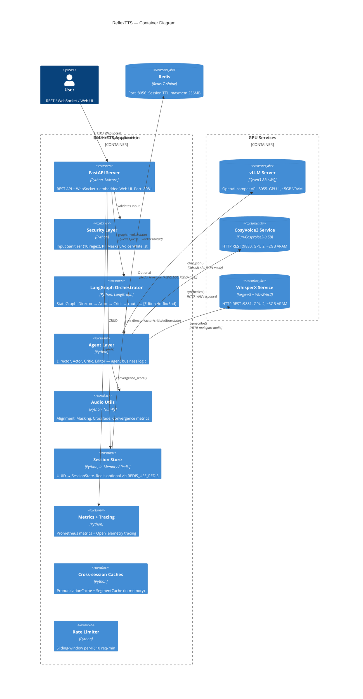

# C4 Container Diagram — ReflexTTS

> Level 2: frontend/backend, orchestrator, retriever, tool layer, storage, observability.



## Container Details

### Application Layer

| Container | Technology | Port | Role |
|-----------|-----------|------|------|
| **FastAPI Server** | Python, Uvicorn | :8081 | REST endpoints + WebSocket + embedded Web UI |
| **Security Layer** | Python, regex | — | Input validation, PII masking, voice access control |
| **LangGraph Orchestrator** | Python, LangGraph | — | DAG execution, conditional routing, state management |
| **Agent Layer** | Python | — | 4 agents: pipeline business logic |
| **Audio Utils** | Python, NumPy | — | Low-level audio processing |
| **Session Store** | Python, dict / Redis | — | Session management (in-memory default, Redis optional) |
| **Metrics + Tracing** | Python, OTel | — | Prometheus metrics + OTel distributed tracing |
| **Caches** | Python | — | PronunciationCache + SegmentCache (cross-session) |
| **Rate Limiter** | Python | — | Sliding-window per-IP rate limiting |

### GPU Services

| Service | Container | GPU | VRAM | Port |
|---------|-----------|-----|------|------|
| vLLM (Qwen3-8B AWQ) | `reflex-vllm` | GPU 1 | ~5 GB | :8055 |
| CosyVoice3 (0.5B) | `reflex-cosyvoice` | GPU 2 | ~2 GB | :9880 |
| WhisperX (large-v3) | `reflex-whisperx` | GPU 2 | ~3 GB | :9881 |

### Storage

| Service | Container | Port | Config |
|---------|-----------|------|--------|
| Redis | `reflex-redis` | :8056 | maxmemory=256MB, TTL=1h |

### Communication

```
User ──HTTP──▶ FastAPI ──Queue──▶ Worker ──async──▶ LangGraph ──async──▶ Agents
                                                                           │
                                                           ┌───────────────┼───────────────┐
                                                           ▼               ▼               ▼
                                                     vLLM :8055    CosyVoice :9880  WhisperX :9881
                                                     (OpenAI API)     (HTTP)           (HTTP)
```
