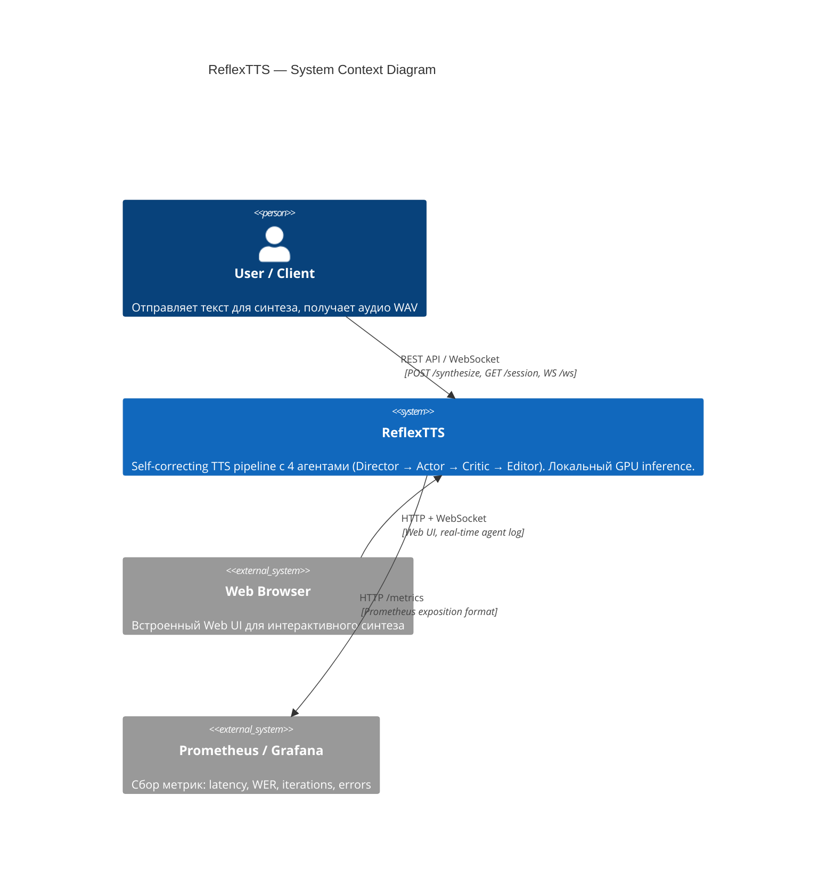

# C4 Context Diagram — ReflexTTS

> Уровень 1: система, пользователь, внешние сервисы и границы.



## Текстовое описание

### Акторы

| Актор | Описание |
|-------|----------|
| **User / Client** | Человек или программа, отправляющая текст через REST API или Web UI |
| **Web Browser** | Встроенный UI (HTML/JS/CSS) для интерактивного доступа |
| **Prometheus / Grafana** | Внешний мониторинг, скрейпит `/metrics` |

### Система

**ReflexTTS** — self-correcting text-to-speech pipeline:
- Принимает текст + voice_id
- Проводит через 4 агента (Director → Actor → Critic → Editor)
- Итеративно исправляет ошибки произношения
- Возвращает WAV аудио с WER ≈ 0

### Границы

```
┌─────────────────────────────────────────────┐
│                Trust Boundary               │
│  ┌────────────────────────────────────────┐  │
│  │         ReflexTTS System               │  │
│  │  ┌──────────┐  ┌──────────────────┐   │  │
│  │  │ FastAPI   │  │ LangGraph        │   │  │
│  │  │ + Web UI  │  │ Orchestrator     │   │  │
│  │  └──────────┘  └──────────────────┘   │  │
│  │  ┌──────────────────────────────────┐ │  │
│  │  │ GPU Services (vLLM, CosyVoice,  │ │  │
│  │  │ WhisperX) — all local            │ │  │
│  │  └──────────────────────────────────┘ │  │
│  └────────────────────────────────────────┘  │
│                                              │
│  ⛔ Нет внешних облачных API                 │
│  ⛔ Нет исходящих запросов с PII             │
│  ✅ Все данные остаются внутри trust boundary│
└─────────────────────────────────────────────┘
```

### Ключевые свойства

- **Полностью локальная система** — нет зависимостей от облачных LLM/TTS/ASR API
- **Единственный внешний интерфейс** — Prometheus scraping (read-only, no PII)
- **PII boundary** — маскировка происходит до входа в pipeline
