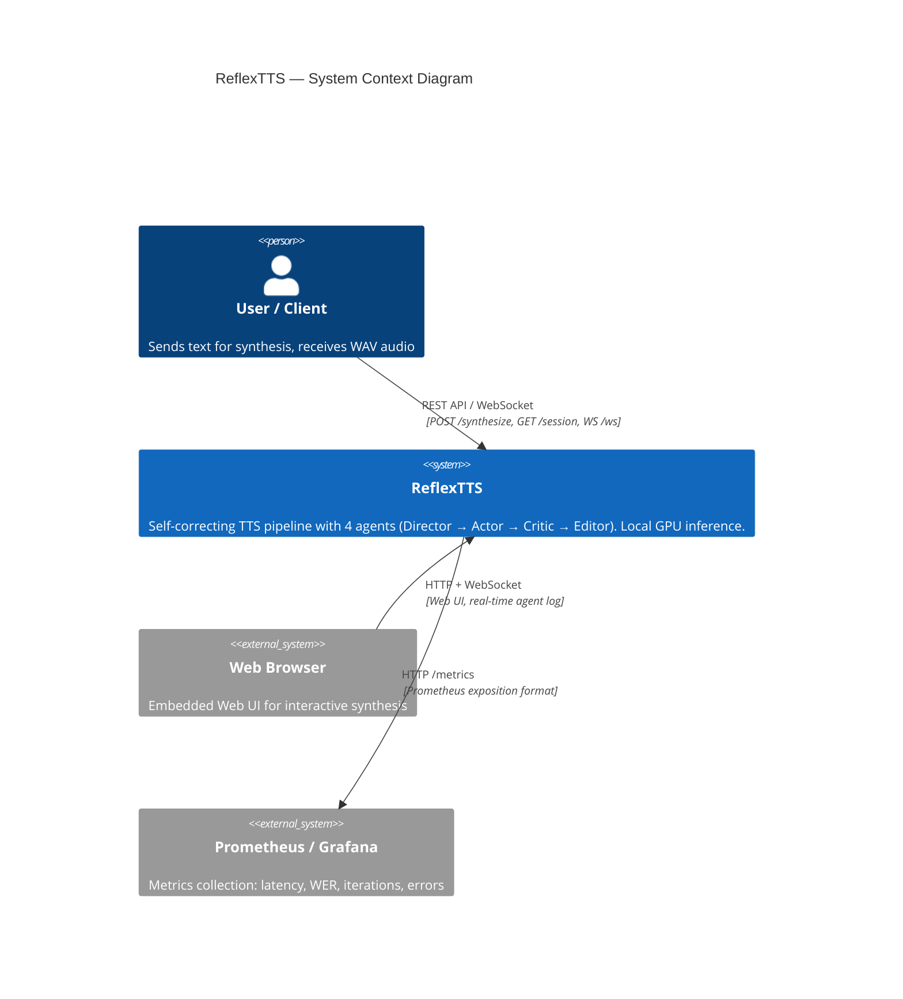

# C4 Context Diagram — ReflexTTS

> Level 1: system, user, external services, and boundaries.



## Description

### Actors

| Actor | Description |
|-------|-------------|
| **User / Client** | Human or application sending text via REST API or Web UI |
| **Web Browser** | Embedded UI (HTML/JS/CSS) for interactive access |
| **Prometheus / Grafana** | External monitoring, scrapes `/metrics` |

### System

**ReflexTTS** — self-correcting text-to-speech pipeline:
- Accepts text + voice_id
- Processes through 4 agents (Director → Actor → Critic → Editor)
- Iteratively corrects pronunciation errors
- Returns WAV audio with WER ≈ 0

### Boundaries

```
┌─────────────────────────────────────────────┐
│                Trust Boundary               │
│  ┌────────────────────────────────────────┐  │
│  │         ReflexTTS System               │  │
│  │  ┌──────────┐  ┌──────────────────┐   │  │
│  │  │ FastAPI   │  │ LangGraph        │   │  │
│  │  │ + Web UI  │  │ Orchestrator     │   │  │
│  │  └──────────┘  └──────────────────┘   │  │
│  │  ┌──────────────────────────────────┐ │  │
│  │  │ GPU Services (vLLM, CosyVoice,  │ │  │
│  │  │ WhisperX) — all local            │ │  │
│  │  └──────────────────────────────────┘ │  │
│  └────────────────────────────────────────┘  │
│                                              │
│  ⛔ No external cloud APIs                   │
│  ⛔ No outgoing requests with PII            │
│  ✅ All data stays within trust boundary     │
└─────────────────────────────────────────────┘
```

### Key Properties

- **Fully local system** — no dependencies on cloud LLM/TTS/ASR APIs
- **Only external interface** — Prometheus scraping (read-only, no PII)
- **PII boundary** — masking occurs before entering the pipeline
