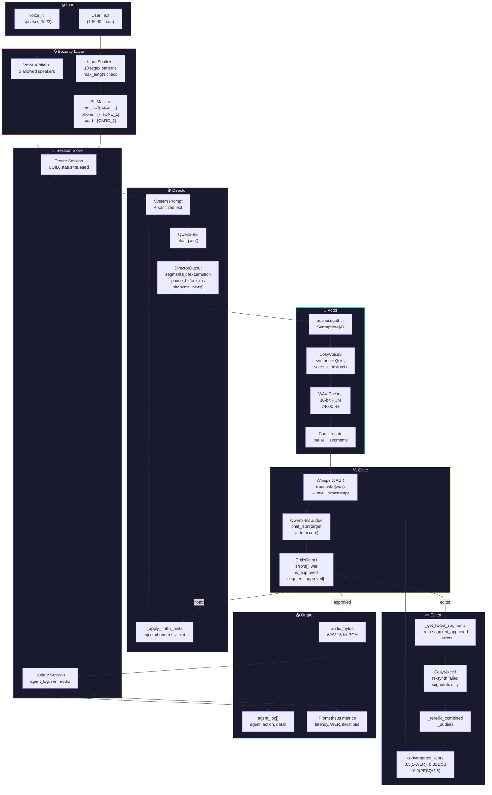

# Data Flow Diagram — ReflexTTS

> How data flows through the system, what is stored, what is logged.

## End-to-End Data Flow



## Data Storage & Lifecycle

### What is Stored

| Data | Where | Lifetime | Format |
|------|-------|----------|--------|
| `GraphState` | RAM (thread local) | Pipeline execution time | Pydantic model → dict |
| `SessionState` | In-memory dict / Redis (`REDIS_USE_REDIS`) | In-memory: until restart. Redis: TTL 1h | Python dataclass |
| `audio_bytes` | `SessionState.audio_bytes` | Until GC / restart | WAV bytes |
| `segment_audio[]` | `GraphState` (RAM) | Pipeline execution time | WAV bytes per segment |
| `agent_log[]` | `SessionState` + WebSocket | Until restart / export | list[dict] |
| Prometheus metrics | `MetricsRegistry` (RAM) | Until restart | Counter/Gauge/Histogram |

### What is Logged

| Level | What | PII | Example |
|-------|------|-----|---------|
| INFO | Agent actions | ❌ No | `director_done segments=3 instruct="Speak with happy tone"` |
| INFO | Pipeline lifecycle | ❌ No | `pipeline_completed wer=0.0 iterations=2 audio_size_kb=150` |
| WARNING | Errors, retries | ❌ No | `injection_detected patterns=["role_override"]` |
| WARNING | Routing decisions | ❌ No | `route_editor iteration=1 failed_segments=[1,3]` |
| ERROR | Failures | ❌ No | `pipeline_failed error="VLLMConnectionError"` |
| DEBUG | Director input length | ❌ No | `director_input_text text_length=142` |
| DEBUG | Raw LLM responses | Possible | `vllm_raw_response raw_preview=...` |

> ✅ **PII leak fixed**: `director_input_text` now logs only `text_length`, not raw text.

### What is NOT Stored

- ❌ Intermediate rejected audio (overwritten on retry)
- ❌ Full LLM prompts after execution
- ❌ Audio/text embeddings (no retrieval layer)

## Data Transformation Pipeline

```
                    STRING            PYDANTIC            DICT              BYTES
User text ─────────────▶ sanitized ───────▶ GraphState ──────▶ state dict ──────▶ WAV
  │                        text                │                    │              │
  │                         │                  │                    │              │
  │    sanitize_input()     │   model_dump()   │   graph.invoke()   │   actor      │
  │    mask_pii()           │   model_validate │   director_node    │   encode_wav │
  │                         │                  │   actor_node       │              │
  │                         │                  │   critic_node      │              │
  │                         │                  │   editor_node      │              │
  │                         │                  │                    │              │
  ▼                         ▼                  ▼                    ▼              ▼

Types:  str             str           GraphState (Pydantic)   dict           bytes
Size:   1-5000 chars    1-5000 chars  ~20 fields              ~20 keys       ~100KB-5MB
```
