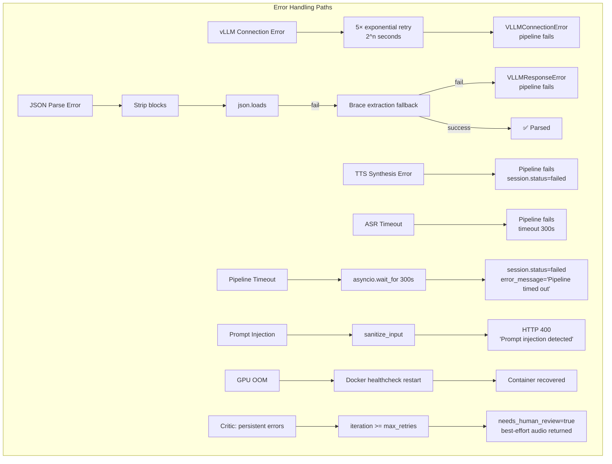
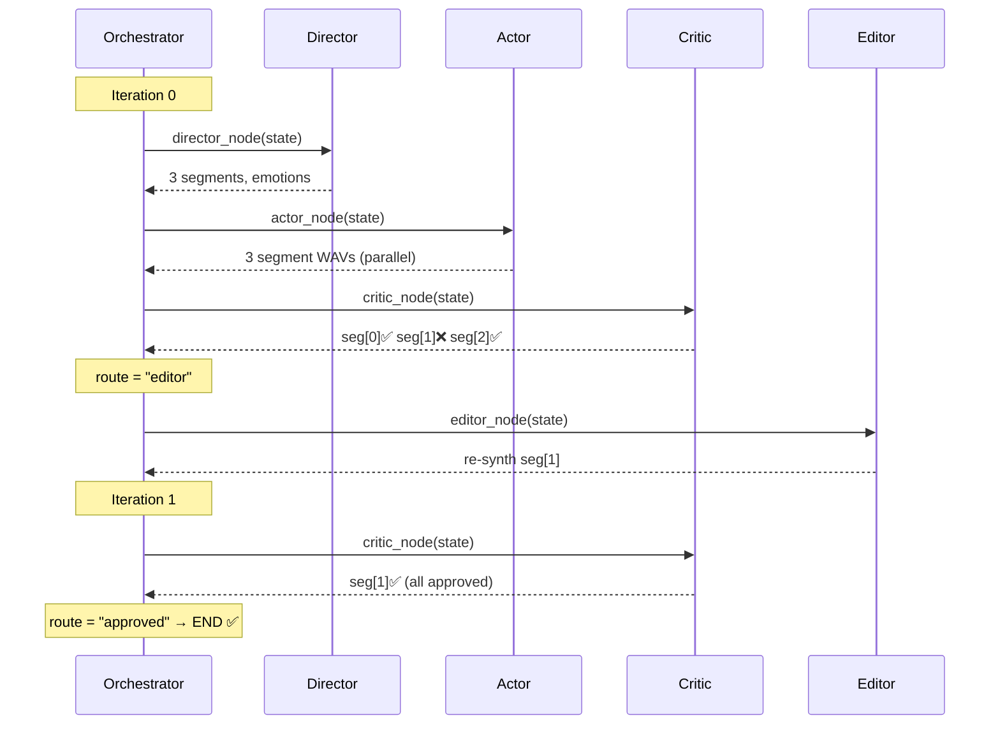

# Workflow / Graph Diagram — ReflexTTS

> Пошаговое выполнение запроса, включая ветки ошибок.

## Main Pipeline Flow

```mermaid
stateDiagram-v2
    [*] --> InputValidation: POST /synthesize

    state InputValidation {
        [*] --> Sanitize: text, voice_id
        Sanitize --> PIIMask: is_safe=true
        Sanitize --> Reject400: is_safe=false
        PIIMask --> VoiceCheck
        VoiceCheck --> CreateSession: voice allowed
        VoiceCheck --> Reject400: voice blocked
    }

    InputValidation --> PipelineThread: Session created (202 Accepted)
    Reject400 --> [*]: HTTP 400

    state PipelineThread {
        [*] --> AcquireSemaphore
        AcquireSemaphore --> Director: Semaphore(1) acquired
        AcquireSemaphore --> Reject503: busy

        state Director {
            [*] --> BuildPrompt
            BuildPrompt --> LLMCall: chat_json(DIRECTOR_PROMPT, text)
            LLMCall --> ParseJSON: DirectorOutput
            ParseJSON --> ParseFail: JSONDecodeError
            ParseFail --> BraceExtract: fallback
            BraceExtract --> HotfixCheck
            ParseJSON --> HotfixCheck
            HotfixCheck --> ApplyHotfix: iteration > 0 && errors exist
            HotfixCheck --> BuildInstruct: first iteration
            ApplyHotfix --> BuildInstruct
            BuildInstruct --> [*]: ssml_markup + tts_instruct ready
        }

        Director --> Actor

        state Actor {
            [*] --> FilterSegments
            FilterSegments --> ParallelSynth: unapproved segments
            FilterSegments --> UseCached: approved segments (skip)
            state ParallelSynth {
                [*] --> SemaphoreAcquire: Semaphore(4)
                SemaphoreAcquire --> TTSCall: CosyVoice3.synthesize()
                TTSCall --> EncodeWAV
                EncodeWAV --> [*]: segment_audio[i]
            }
            UseCached --> Assembly
            ParallelSynth --> Assembly
            Assembly --> [*]: audio_bytes (concatenated WAV)
        }

        Actor --> Critic

        state Critic {
            [*] --> PerSegmentLoop
            state PerSegmentLoop {
                [*] --> CheckApproved
                CheckApproved --> SkipSegment: already approved
                CheckApproved --> ASRPhase: not approved
                ASRPhase --> JudgePhase: transcript + word_timestamps
                JudgePhase --> RecordResult: CriticOutput per segment
                SkipSegment --> [*]
                RecordResult --> [*]
            }
            PerSegmentLoop --> AggregateResults
            AggregateResults --> [*]: is_approved, wer, errors[], segment_approved[]
        }

        Critic --> RouteDecision

        state RouteDecision {
            [*] --> CheckApproved2: is_approved?
            CheckApproved2 --> Approved: true
            CheckApproved2 --> CheckMaxRetries: false
            CheckMaxRetries --> HumanReview: iteration >= max_retries
            CheckMaxRetries --> CheckHotfix: iteration < max_retries
            CheckHotfix --> HotfixRoute: all errors can_hotfix
            CheckHotfix --> EditorRoute: non-hotfix errors exist
        }

        Approved --> PipelineEnd: ✅ Final Audio
        HumanReview --> MarkEscalation: needs_human_review = true
        MarkEscalation --> PipelineEnd: ⚠️ Best-effort audio
        HotfixRoute --> Director: phoneme hints in errors
        EditorRoute --> Editor

        state Editor {
            [*] --> FindFailed: _get_failed_segments()
            FindFailed --> RegenLoop
            state RegenLoop {
                [*] --> ReSynth: tts.synthesize(segment_text)
                ReSynth --> UpdateSegmentAudio: segment_audio[i] = new WAV
                UpdateSegmentAudio --> [*]
            }
            RegenLoop --> RebuildAudio: _rebuild_combined_audio()
            RebuildAudio --> CalcConvergence: convergence_score()
            CalcConvergence --> [*]
        }

        Editor --> Critic: re-evaluate repaired audio

        PipelineEnd --> ReleaseSemaphore
    }

    Reject503 --> [*]: HTTP 503

    PipelineThread --> UpdateSession: status=completed/failed
    UpdateSession --> [*]: audio available via GET /session/{id}/audio
```

## Error Branches (подробно)

```mermaid
flowchart TD
    subgraph "Error Handling Paths"
        E1[vLLM Connection Error] --> R1["5× exponential retry<br/>2^n seconds"]
        R1 --> F1[VLLMConnectionError<br/>pipeline fails]

        E2[JSON Parse Error] --> S1["Strip <think> blocks"]
        S1 --> P1[json.loads]
        P1 --> |fail| B1[Brace extraction fallback]
        B1 --> |fail| F2[VLLMResponseError<br/>pipeline fails]
        B1 --> |success| OK1[✅ Parsed]

        E3[TTS Synthesis Error] --> F3[Pipeline fails<br/>session.status=failed]

        E4[ASR Timeout] --> F4[Pipeline fails<br/>timeout 300s]

        E5[Pipeline Timeout] --> T1[asyncio.wait_for 300s]
        T1 --> F5["session.status=failed<br/>error_message='Pipeline timed out'"]

        E6[Prompt Injection] --> S2[sanitize_input]
        S2 --> F6["HTTP 400<br/>'Prompt injection detected'"]

        E7[GPU OOM] --> H1[Docker healthcheck restart]
        H1 --> OK2[Container recovered]

        E8[Critic: persistent errors] --> M1["iteration >= max_retries"]
        M1 --> F8["needs_human_review=true<br/>best-effort audio returned"]
    end
```

## Iteration Flow Example

```mermaid
sequenceDiagram
    participant O as Orchestrator
    participant D as Director
    participant A as Actor
    participant C as Critic
    participant E as Editor

    Note over O: Iteration 0
    O->>D: director_node(state)
    D-->>O: 3 segments, emotions
    O->>A: actor_node(state)
    A-->>O: 3 segment WAVs (parallel)
    O->>C: critic_node(state)
    C-->>O: seg[0]✅ seg[1]❌ seg[2]✅

    Note over O: route = "editor"
    O->>E: editor_node(state)
    E-->>O: re-synth seg[1]

    Note over O: Iteration 1
    O->>C: critic_node(state)
    C-->>O: seg[1]✅ (all approved)

    Note over O: route = "approved" → END ✅
```
