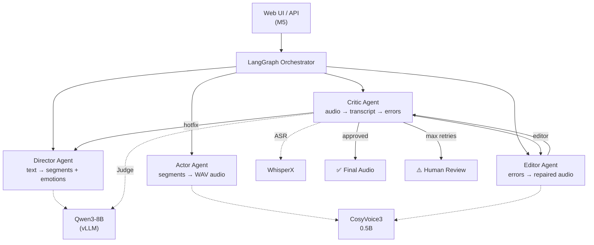

# ReflexTTS — Обзор проекта

> Самокорректирующийся TTS с агентным пайплайном: Director → Actor → Critic → Editor.
> Стек: **Qwen3-8B** (vLLM) + **CosyVoice3** (0.5B) + **WhisperX** — всё локально.

---

## Текущий статус

| Milestone | Статус | Тесты | Описание |
|-----------|--------|-------|----------|
| M0: Инфраструктура | ✅ Готов | 12 | Структура, config, Docker, CI/CD |
| M1: Inference Backend | ✅ Готов | 45 | vLLM, CosyVoice3, WhisperX клиенты |
| M2: Агентный пайплайн | ✅ Готов | 73 | Director, Actor, Critic, LangGraph |
| M3: Editor + Inpainting | ✅ Готов | 94 | Editor, audio utils, convergence metrics |
| M4: Security & Governance | 🔲 | — | Input sanitizer, PII, whitelist |
| M5: API & Web UI | 🔲 | — | FastAPI, WebSocket, UI |
| M6: Benchmarks | 🔲 | — | WER, SECS, PESQ, load testing |
| M7: Production | 🔲 | — | PyTriton, monitoring, K8s |

**Проверки:** `ruff check` ✅ · `mypy --strict` ✅ (26 файлов, 0 ошибок) · `pytest` ✅ (94/94)

---

## Архитектура



---

## Карта файлов

### `src/` — исходный код

```
src/
├── config.py                    # Pydantic Settings — все конфиги из env
├── log.py                       # structlog: JSON (prod) / console (dev)
│
├── inference/                   # M1 — клиенты к моделям
│   ├── __init__.py              # Публичный API пакета
│   ├── vllm_client.py           # Async OpenAI-compatible → Qwen3-8B
│   ├── tts_client.py            # CosyVoice3 AutoModel wrapper
│   ├── asr_client.py            # WhisperX + forced alignment
│   └── model_registry.py        # Lifecycle: init → health → shutdown
│
├── agents/                      # M2 + M3 — агенты
│   ├── __init__.py              # Экспорт типов
│   ├── schemas.py               # DirectorOutput, CriticOutput, Segment
│   ├── prompts.py               # System prompts для Qwen3-8B (JSON)
│   ├── director.py              # Текст → сегменты + эмоции + phoneme hints
│   ├── actor.py                 # Сегменты → WAV (concat + pause + encode)
│   ├── critic.py                # ASR → Judge → ошибки + WER
│   └── editor.py                # Inpainting (FM) / chunk regen (fallback)
│
├── audio/                       # M3 — аудио-утилиты
│   ├── __init__.py
│   ├── alignment.py             # ms → mel-frame indices, MelRegion
│   ├── masking.py               # Binary mask + cosine taper
│   ├── crossfade.py             # Equal-power cross-fade
│   └── metrics.py               # Convergence score (WER+SECS+PESQ)
│
├── orchestrator/                # M2 — LangGraph
│   ├── __init__.py
│   ├── state.py                 # GraphState, DetectedError, AgentLogEntry
│   └── graph.py                 # build_graph() — 4-way routing
│
├── api/                         # M5 (stub)
│   ├── __init__.py
│   └── app.py                   # FastAPI factory: /health, /voices
│
└── security/                    # M4 (пустой)
    └── __init__.py
```

### `tests/` — тесты

```
tests/
└── unit/
    ├── test_config.py           # 8 тестов — конфигурация
    ├── test_logging.py          # 4 теста — логирование
    ├── test_vllm_client.py      # 8 тестов — chat, JSON, retries, health
    ├── test_tts_client.py       # 8 тестов — AudioResult, voices, guards
    ├── test_asr_client.py       # 4 теста — WordTimestamp, guards
    ├── test_model_registry.py   # 4 теста — lifecycle
    ├── test_schemas.py          # 10 тестов — Pydantic validation
    ├── test_director.py         # 3 теста — segments, hotfix injection
    ├── test_actor.py            # 6 тестов — WAV encoding/decoding
    ├── test_critic.py           # 5 тестов — WAV decode, text extraction
    ├── test_graph.py            # 4 теста — graph construction, state
    ├── test_audio.py            # 18 тестов — alignment, mask, crossfade, metrics
    └── test_editor.py           # 3 теста — skip paths, fallback
```

### `docker/` + CI/CD

```
docker/
├── docker-compose.yml           # vLLM + Redis + App
└── Dockerfile.app               # Multi-stage, non-root

.github/workflows/ci.yml         # lint → type-check → security → tests
.pre-commit-config.yaml          # Ruff, Mypy, Bandit, Detect Secrets
.env.example                     # Шаблон переменных окружения
```

### `docs/` — документация

```
docs/
├── governance.md                # Governance-модель
├── product-proposal.md          # Продуктовое описание
├── latent-inpainting-architecture.md  # Архитектура inpainting
├── walkthrough-m0-infrastructure.md   # Walkthrough M0
├── walkthrough-m1-inference.md        # Walkthrough M1
├── walkthrough-m2-agents.md           # Walkthrough M2
└── walkthrough-m3-editor.md           # Walkthrough M3
```

---

## Потоки данных в пайплайне

```
User text
  │
  ▼
┌─────────────────────────────────────────────┐
│ Director (Qwen3-8B)                         │
│ Input:  text                                │
│ Output: DirectorOutput (segments, emotions) │
│         → ssml_markup, tts_instruct         │
└──────────────────┬──────────────────────────┘
                   ▼
┌─────────────────────────────────────────────┐
│ Actor (CosyVoice3)                          │
│ Input:  ssml_markup + tts_instruct          │
│ Output: audio_bytes (WAV 16-bit PCM)        │
└──────────────────┬──────────────────────────┘
                   ▼
┌─────────────────────────────────────────────┐
│ Critic (WhisperX → Qwen3-8B Judge)          │
│ Phase 1: ASR → transcript + word_timestamps │
│ Phase 2: Judge → errors + wer + is_approved │
└──────────────────┬──────────────────────────┘
                   ▼
          ┌────────┼────────┐
          ▼        ▼        ▼
       Approved  Hotfix   Editor
       (END)     (→Dir)   (→Critic)
```

### GraphState — ключевые поля

| Поле | Тип | Кто пишет | Кто читает |
|------|-----|----------|-----------|
| `text` | str | User | Director |
| `voice_id` | str | User | Actor |
| `ssml_markup` | dict | Director | Actor |
| `tts_instruct` | str | Director | Actor |
| `audio_bytes` | bytes | Actor/Editor | Critic |
| `transcript` | str | Critic (ASR) | Critic (Judge) |
| `word_timestamps` | list | Critic (ASR) | Critic (Judge) |
| `errors` | list[DetectedError] | Critic (Judge) | Editor/Director |
| `wer` | float | Critic | Graph routing |
| `is_approved` | bool | Critic | Graph routing |
| `iteration` | int | Graph | Graph routing |
| `convergence_score` | float | Editor | Observability |

---

## GPU Budget (~10 GB)

| Модель | Компонент | VRAM |
|--------|----------|------|
| Qwen3-8B-Instruct AWQ 4-bit | Director + Critic Judge | ~5 GB |
| CosyVoice3 0.5B | Actor + Editor | ~2 GB |
| WhisperX (large-v3 + Wav2Vec2) | Critic ASR | ~3 GB |

---

## Как запустить

```bash
# Установка зависимостей
pip install -e ".[dev]"

# Проверки
ruff check src/ tests/         # Lint
python -m mypy src/             # Type check
python -m pytest tests/unit/ -v # Тесты (94 шт)

# Docker (требует GPU)
cd docker && docker compose up -d
```

---

## Что дальше (M4–M7)

### M4: Security & Governance (~1 неделя)
- `input_sanitizer.py` — prompt injection guard (regex + LLM classifier)
- `pii_masker.py` — NER маскирование → деанонимизация перед TTS
- `voice_whitelist.py` — только 3 разрешённых голоса
- Ephemeral data: tmpfs, auto-cleanup
- Human-in-the-Loop: WER > 15% → блокировка → оператор

### M5: API & Web UI (~1.5 недели)
- `POST /synthesize`, `GET /voices`, `GET /session/{id}/status`
- WebSocket: real-time стриминг agent log
- Web UI: ввод текста, выбор голоса, progress bar, audio player
- Redis: session state + TTL cleanup

### M6: Benchmarking (~1.5 недели)
- 50 текстов: диалоги, имена, аббревиатуры, омографы, mixed-language
- A/B: latent inpainting vs hotfix vs full-regen
- Целевые метрики: WER < 1%, SECS > 0.85, avg loops < 2.5, RTF < 4.0

### M7: Production (~1 неделя)
- PyTriton обёртки для CosyVoice3 + WhisperX (dynamic batching)
- Prometheus + Grafana dashboards
- Alerting: GPU OOM, error rate, avg loops > 3
- Kubernetes manifests
