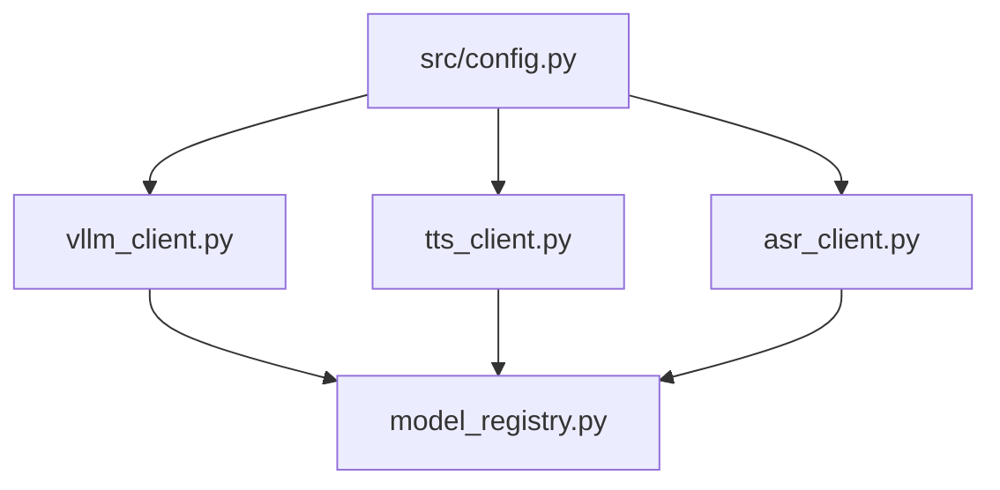

# Milestone 1: Inference Backend

## Результат
✅ Lint ✅ Mypy (15 файлов) ✅ 45 тестов

## Архитектура

## Модули

| Модуль | Методы | Использует |
|--------|--------|-----------|
| `vllm_client.py` | `chat()`, `chat_json()`, `health_check()` | Director, Critic |
| `tts_client.py` | `synthesize()`, `clone_voice()`, `load_model()` | Actor, Editor |
| `asr_client.py` | `transcribe()` → `TranscriptionResult` + `WordTimestamp` | Critic |
| `model_registry.py` | `initialize()`, `health()`, `shutdown()` | App startup |

## Data Classes

| Класс | Поля | Файл |
|-------|------|------|
| `AudioResult` | waveform, sample_rate, duration_seconds | tts_client.py |
| `WordTimestamp` | word, start_ms, end_ms, score | asr_client.py |
| `TranscriptionResult` | text, word_timestamps, language | asr_client.py |
| `HealthStatus` | vllm, tts, asr (bool) | model_registry.py |

## Особенности реализации

- **vLLM**: один инстанс Qwen3-8B обслуживает Director + Critic через разные system_prompt
- **chat_json()**: парсит ответ LLM в Pydantic модель, экспоненциальный retry
- **TTS**: `asyncio.to_thread()` для non-blocking GPU inference
- **ASR**: WhisperX forced alignment → ±50ms точность границ слов
- **Registry**: ordered GPU loading: vLLM → CosyVoice3 → WhisperX

## Тесты (45)

| Файл | Кол-во | Покрытие |
|------|--------|---------|
| test_config.py | 8 | Defaults, security, tmp_dir |
| test_logging.py | 4 | Dev/JSON, noisy loggers |
| test_vllm_client.py | 8 | Chat, JSON, retries, errors, health |
| test_tts_client.py | 8 | AudioResult, synthesize, clone, voice |
| test_asr_client.py | 4 | WordTimestamp, TranscriptionResult, guards |
| test_model_registry.py | 4 | HealthStatus, init, shutdown |
