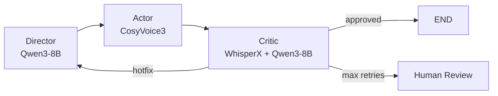

# Milestone 2: Агентный пайплайн

## Результат
✅ Lint ✅ Mypy (21 файл) ✅ 73 теста

## Архитектура

## Файлы

| Файл | Назначение | Ключевые типы |
|------|-----------|--------------|
| `agents/schemas.py` | Контракты между агентами | `DirectorOutput`, `CriticOutput`, `Segment`, `CriticError` |
| `agents/prompts.py` | System prompts для Qwen3-8B | `DIRECTOR_SYSTEM_PROMPT`, `CRITIC_JUDGE_SYSTEM_PROMPT` |
| `agents/director.py` | Текст → сегменты + эмоции | `run_director()`, `_apply_hotfix_hints()` |
| `agents/actor.py` | Сегменты → WAV аудио | `run_actor()`, `_encode_wav()`, `_decode_wav_to_array()` |
| `agents/critic.py` | Аудио → транскрипт → ошибки | `run_critic()`, `_extract_target_text()` |
| `orchestrator/graph.py` | LangGraph state machine | `build_graph()` с conditional routing |

## Потоки данных

| Поле в GraphState | Записывает | Читает |
|-------------------|-----------|--------|
| `ssml_markup` (DirectorOutput) | Director | Actor |
| `tts_instruct` | Director | Actor |
| `audio_bytes` (WAV) | Actor | Critic |
| `transcript` + `word_timestamps` | Critic (ASR) | Critic (Judge) |
| `errors` + `wer` + `is_approved` | Critic (Judge) | Graph routing |
| `can_hotfix` + `hotfix_hint` | Critic | Director (retry) |

## Routing Logic

1. **Approved** (`is_approved=True`): WER=0 или только INFO ошибки → END
2. **Hotfix** (`can_hotfix=True`): Ошибки произношения → phoneme hints → Director retry
3. **Human Review**: Max retries (3) → `needs_human_review=True`

## Тесты (+28 новых)

| Файл | Кол-во | Покрытие |
|------|--------|---------|
| test_schemas.py | 10 | Segment, DirectorOutput, CriticOutput validation |
| test_director.py | 3 | Segments, logging, hotfix injection |
| test_actor.py | 6 | WAV encoding (header, data, roundtrip, sample rate) |
| test_critic.py | 5 | WAV decoding, target text extraction |
| test_graph.py | 4 | Graph construction, node presence, state serialization |
