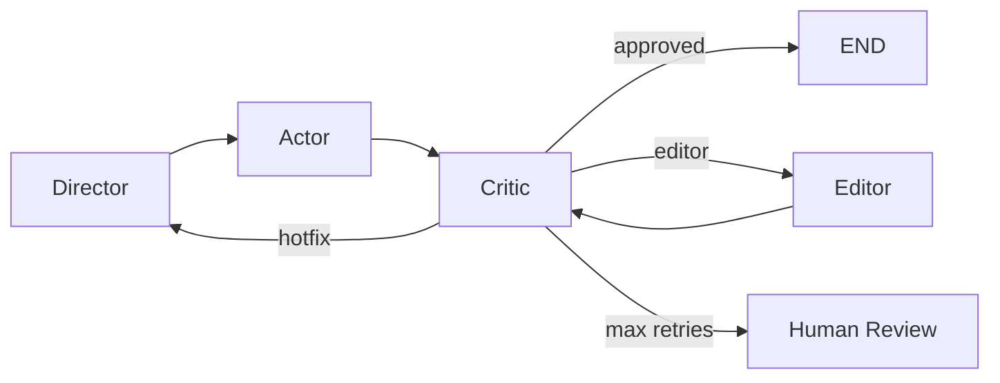

# Milestone 3: Editor Agent + Latent Inpainting

## Результат
✅ Lint ✅ Mypy (26 файлов) ✅ 94 теста

## Архитектура



## Новые модули

### Audio Utils (`src/audio/`)

| Файл | Назначение |
|------|-----------|
| `alignment.py` | Timestamps (ms) → mel-frame indices, `MelRegion`, region merging |
| `masking.py` | Binary mask + cosine taper для FM inpainting, `apply_mask_to_mel()` |
| `crossfade.py` | Equal-power cross-fade для chunk-based repair |
| `metrics.py` | Convergence score: `a*(1-WER) + b*SECS + g*PESQ`, `compute_secs()` |

### Editor Agent (`src/agents/editor.py`)

Два пути коррекции:

| Путь | Когда | Как |
|------|-------|-----|
| **Latent Inpainting** | FM модуль CosyVoice3 доступен | mel mask → FM ODE → vocoder |
| **Chunk Regen** (fallback) | FM недоступен | Re-synthesize → cross-fade |

### Обновлённый граф (4-way routing)

| Решение | Условие | Действие |
|---------|---------|---------|
| `approved` | `is_approved=True` | → END |
| `hotfix` | Все ошибки `can_hotfix` | → Director (phoneme hints) |
| `editor` | Есть non-hotfix ошибки | → Editor → Critic (re-eval) |
| `escalate` | `iteration >= max_retries` | → Human Review |

## Ключевые алгоритмы

### Alignment (ms → mel frames)
```
start_sample = (start_ms - padding_ms) * sample_rate / 1000
start_frame  = start_sample // hop_length
```

### Inpainting Mask
```
mask = ones(n_mels, total_frames)      # 1 = keep original
mask[:, start:end] = 0                  # 0 = regenerate
+ cosine taper at boundaries
```

### Convergence Score
```
score = 0.5*(1-WER) + 0.3*SECS + 0.2*(PESQ/4.5)
converged = score >= 0.85
```

## Тесты (+21 новых)

| Файл | Кол-во | Покрытие |
|------|--------|---------|
| test_audio.py | 18 | Alignment, masking, crossfade, metrics, SECS |
| test_editor.py | 3 | Skip paths, graceful failure |
